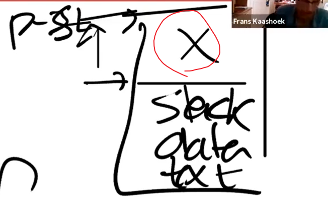

# 8.2 Lazy Page allocation

[toc]

首先我们先来看一下allocation，特别是sbrk，这个是XV6提供的一个系统调用，用于用户程序扩大自己的heap。当一个应用程序启动的时候，sbrk指向的是heap的最底端，同时也是stack的顶端。这个位置通过代表进程的数据结构中的sz字段表示，这里以p->sz表示。

%20(1).png)

当调用sbrk时，入参是整数比如3，4，5这种，这代表了你想要申请的Page的数量（注，原视频说的是page，但是根据Linux [man page](https://man7.org/linux/man-pages/man2/sbrk.2.html)，实际中sbrk的参数是字节数）。sbrk会扩展heap的上边界（也就是会扩大heap）。

.png)

这意味着，当sbrk实际发生或者被调用时，内核会分配一些物理内存，然后将其映射到用户程序的地址空间中，然后将这些物理内存的内容初始化为0，再返回sbrk的系统调用。这样，应用程序可以通过多次调用sbrk系统调用来扩大它的内容。当然应用程序也可以通过给sbrk传入负数参数，来减少它的地址空间。但是本节课我们暂时只关注增加地址空间的场景。

在XV6中的sbrk的实现默认是eager allocation。这表示一旦调用了sbrk系统调用，内核会立即分配相应的物理内存给应用程序。但是在实际生活中，应用程序很难准确预测自己需要多少内存。所以通常来说，应用程序倾向于“多要”内存，这意味着，进程的内存消耗会增加许多，但是有部分内存永远也不会被应用程序用到。

你此时可能会认为这很愚蠢。但是想象一下，你现在写一个应用程序，读取一些参数然后通过一个矩阵进行一些运算，作为应用程序的编写组你肯定会为最坏的情况做打算，比如为最大的可能的矩阵分配内存，但是应用程序可能永远也不用不上这么大的矩阵。通常情况下，应用程序会在一个小得多的矩阵上计算。所以，通常情况就是这样，程序员经常申请过多的内存但是过少的使用申请的内存。

原则上来说，这不是个大问题，但是通过virtual memory与Page fault handler这两种机制，我们可以用更聪明的方式来处理上述所说的问题，即Lazy allocation这种方式。

Lazy allocation的核心思想很简单，sbrk系统调用基本上啥都不干，唯一要做的就是提升p->sz的值，比如将p->sz的值增加n，其中n是需要新分配的内存page数量。但是内核此时并不实际分配实际的物理内存给应用进程。在之后的某个时间点，当进程真正用到这部分通过sbrk申请内存的时候，此时会触发Page fault，这是因为我们没有将这部分内存映射到实际的物理内存上。所以当我们解析一个虚拟地址，这个虚拟地址大于旧的p->sz，但是小于新的p->sz 的话（注，也就是旧的p->sz + n），我们希望此时内核重新分配一个内存Page，然后重新执行指令。

所以当我们看到一个Page fault，相应的虚拟地址小于当前的p->sz，但是大于stack的地址，那么我们知道这是一个来自于heap的地址，但是内核还没有分配任何物理内存。所以对于这个page fault的响应也理所当然的直接明了：在page fault handler中，通过kalloc函数分配一个内存Page；初始化这个内存Page内容为0；将这个Page映射到user Page table中。最后重新执行这条指令。比如说，如果是load指令，或者store指令要访问的内存属于当前进程还未分配的内存，当我们映射完物理内存Page之后，重新执行该指令就好了。

.png)

>学生提问：在eager allocation的场景，一个进程可能消耗了太多的内存进而耗尽了物理内存资源。如果我们不使用eager allocation，而是使用lazy allocation，应用程序怎么才能知道当前已经没有物理内存可用了？
>
>Frans教授：这是个好问题，从应用程序的角度看，会有一个错觉：存在无数多可用的物理内存。但是在某个时间点，应用程序可能会用光了物理内存，之后如果应用程序再访问一个未被分配的page，但这时又没有物理内存，这时内核可以有两个选择，我稍后会介绍更复杂的那个。在Lazy lab中要做的是，返回一个错误然后kill掉进程，因为现在内存耗尽了OOM（out of memory）了，内核也无能为力。
>
>这节课稍后部分会介绍一个更加聪明的解决方案。
>
>学生提问：如何判断一个地址是新分配的内存还是一个无效的地址？
>
>Frans教授：还记得吗，在地址空间中，我们有stack，data与text。通常来说我们将p->sz设置成一个很大的数，所以下图画×部分还没有被实际分配物理内存，如果一个虚拟地址低于p->sz，那么这是一个用户空间的有效地址，如果虚拟地址大于p->sz，那么这就是一个程序错误，这意味着用户应用程序尝试解析一个自己不拥有的虚拟地址。
>
>
>
>学生提问：为什么我们需要杀掉进程？操作系统不能只是返回一个错误说现在已经OOM了，尝试做一些别的操作吧。
>
>Frans教授：让我们稍后再回答这个问题。在XV6的Page fault中，我们默认会直接杀掉进程，但是这里的处理可以更加的聪明。实际的操作系统的处理也会更加聪明，尽管如此，如果最终还是找不到可用的内存，实际的操作系统也还是可能kill掉进程

为了进一步理解Lazy allocation，我们大概来一下它的代码会是怎么样？这也是今天唯一编程相关的内容。实际上你可能会感到奇怪，相关的代码是如此的简单。这部分代码介绍对于接下来的Lazy lab有很大的帮助。

我们首先要修改的sys_sbrk函数，sys_sbrk会实际增加应用程序的地址空间，分配内存等等一系列相关操作。

.png)

这里我们要修改这个函数，让它只对p->sz加n，并不执行增加内存的操作。

.png)

修改之后我们启动xv6，并且执行“echo hi”，我们会得到一个page fault。

.png)

之所以会得到一个page fault是因为，在shell中执行程序，shell会先fork一个子进程，子进程会通过exec执行echo（注，详见1.9）。在这个过程中，shell会申请一些内存，所以shell会调用sys_sbrk然后就出错了（注，因为前面修改了代码，调用sys_sbrk不会实际分配所需要的内存）。

这里输出的内容包含了一些有趣的信息：

* 这里输出了SCAUSE寄存器内容，我们可以看到它的值是15，表明这是一个store page fault（详见8.1）。
* 我们可以看到进程的pid是3，这可能是shell的pid。
* 我们还可以看到SEPC寄存器的值，是0x12a4。
* 最后还可以看到出错的虚拟内存地址，也就是STVAL寄存器的内容，是0x4008。

我们可以查看shell的汇编代码，这是由makefile创建的。我们搜索SEPC对应的地址0x12a4的指令，发现确实是一条store指令。这看起来就是我们出现page fault的位置。

.png)

如果我们稍微向前看看汇编代码，我们可以看到page fault是出现在malloc的实现代码中。这也非常合理，在malloc的实现中，我们使用sbrk系统调用来获得一些内存，之后会初始化我们刚刚获取到的内存，在0x12a4位置，刚刚获取的内存中写入数据，但是实际上我们在向未被分配的内存写入数据。

另一个可以证明内存还没有分配的地方是，xv6中shell通常有4个page，包括了text和data。出错的地址在4个page之外。也就是第5个page，实际上我们在4个page之外8个字节。这也是合理的，因为在0x12a4对应的指令中，a0持有的是0x4000，而8相对a0的偏移量。偏移之后的地址就是我们想要使用的地址（注，也就是出错的地址）。

以上就是page fault的信息。我们接下来看看如何能够聪明的处理这里的page fault。

首先查看trap.c中的usertrap中的函数，usertrap在lec06中有介绍。在usertrap中根据不同的SCAUSE完成不同的操作。

.png)

在lec06中，我们是因为SCAUSE == 8进入的trap，这是我们处理普通系统调用的代码。如果SCAUSE不等于8，接下来会检查是否有任何的设备中断，如果有的话处理相关的设备中断。如果两个条件都不满足，这里会打印一些信息，并且杀掉进程。

现在我们需要增加一个检查，判断SCAUSE==15，如果符合条件，我们可以做一些处理。

> 学生回答：我们想要检查p->sz是否大于当前存在STVAL寄存器中的虚拟地址。如果大于的话，就实际分配物理内存。

这是一种处理方式。这里我会以演示为目的简单的处理一下，在lazy lab中你们需要完成更多的工作。

.png)

在上面增加的代码中，首先打印一些调试信息。之后分配一个物理内存page，如果ka等于0，表明没有物理内存我们现在OOM了，我们会杀掉进程。如果有物理内存，首先会将内存内容设置为0，之后将物理内存page指向用户地址空间中合适的虚拟内存地址。具体的说，我们首先将虚拟地址向下取整，这里引起page fault的虚拟地址是0x4008，向下取整之后是0x4000。之后我们将物理内存地址跟取整之后的虚拟内存地址的关系加到page table中。对应的PTE需要设置常用的权限标志位，在这里是`u，w，r `bit位。

接下来重新编译xv6然后启动，再执行`echo hi`，我们或许可以乐观的认为现在可以正常工作了。

.png)

我们现在可以看到2个page fault，第一个对应的虚拟地址是0x4008，但是很明显在处理这个page fault时，我们又有了另一个page fault 0x13f48。现在唯一的问题是，uvmunmap再报错，一些它尝试unmap的page并不存在。这里unmap的内存是什么？

> 学生回答：之前lazy allocation但是又没实际分配的内存

是的，完全正确。这里unmap的是之前lazy allocated，但是又还没有用到的地址。所以对于这个内存，并没有对应的物理内存。所以在uvmunmap函数中，当PTE的v标志为0表示没有对应的mapping，这并不是一个实际的panic，在lazy allocation模式中这属于我们预期内的行为。

.png)

实际上，对于这个page我们并不用做任何事情，我们可以直接continue跳到下一个page。

.png)

接下来我们再重新编译xv6然后启动，再执行`echo hi`：

.png)

现在我们可以看到2个page fault，但是echo hi正常工作了。现在，我们一定程度上有了最基本最简单的lazy allocation。这里有什么问题吗？

>学生提问：我并不理解为什么在uvmunmap中可以直接改成continue
>
>Frans教授：看代码这个分支表示，我们在free一个没有实际映射物理内存的page。怎么会发生这种情况呢？唯一的解释是sbrk向上移动了p->sz，但是应用程序从来没有使用过这部分内存。因为对应的物理内存还没有分配，所以这部分新增加的内存没有映射关系。因为我们现在是lazy allocation，所以我们只会为我们实际用到的内存分配实际的物理内存page。如果我们不需要这部分内存，那么就不会存在map关系，这非常的合理。相应的，我们对于这部分内存也不能释放，因为没有实际的物理内存可以释放，所以这里最好的处理方式就是continue，跳过并处理下一个page。
>
>学生提问：在uvmunmap中，我认为之前的panic存在是有理由的，我们是不是应该先判断一下，然后对于特定的场景应该还需要panic？
>
>Frans教授：为什么之前的panic存在？因为对于没有修改的xv6，永远不存在用户的内存没有实际map的情况，所以一旦出现这种情况需要panic。我们现在修改了xv6，所以我们需要去掉这里的panic，因为之前的不可能变成了可能。

这部分内容对于下一个实验有很大的帮助，实际上这是下一个实验3个部分中的一个，但是很明显这部分不足以完成下一个lazy lab。我们在这里做了一些修改，但是很多地方还是有可能出错。就像有人提到过的我们这里没有检查触发page fault的虚拟地址是否小于p->sz。还有其他的可能出错的地方吗？

> 学生提问：通过sbrk增加的用户进程的内存的字节数是整数，而不是一个无符号的正整数，所以可能会传入一个负数

是的，传入负数表示我们希望减少用户的地址空间，我们也需要小心一些。实际上，在一个操作系统中，我们可能会在各种各样的用户场景中使用这里的PTE，对于不同的用户场景我们或许需要稍微修改XV6，这就是接下来的lazy lab的内容。你们需要完成足够多的修改，才能通过所有的测试用例。