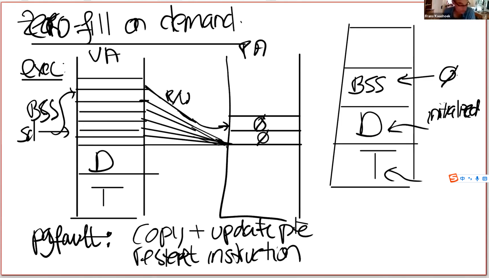

# Zero fill on demand

[toc]

接下来我将讨论基于page fault和page table可以做的一些其他很酷的事情。另一个简单但是使用的非常频繁的功能是zero fill on demand。

当你查看一个用户程序的地址空间时，存在text区，data区，同时还有一个BSS区域（注，BSS区域包含了未被初始化或者初始化为0的全局或者静态变量）。当编译器在生成二进制文件时，编译器会填入这三个区域。text区域是程序的指令，data区域存放的是初始化了的全局变量，BSS包含了未被初始化或者初始化为0的全局变量。

之所以这些变量要单独列出来，是因为例如你在C语言中定义了一个大的矩阵作为全局变量，它的元素初始值都是0，为什么要为这个矩阵分配内存呢？其实只需要记住这个矩阵的内容是0就行了。

.png)                                       

在一个正常的操作系统重，如果执行exec，exec会申请地址空间，里面会存放text与data。因为BSS里面保存了未被初始化的全局变量且全都是0，这里或许有很多很多个page，但是所有的page内容都为0。

通常可以调优的方式是，既然我有如此多的page全都是0，我该怎么处理物理内存呢？我只需分配一个page，这个page的内容全是0。然后将所有虚拟地址空间全0的page都map到这个物理page上。这样至少在程序启动的时候能节省大量的物理内存分配。

.png)

当然这里的mapping需要十分的小心，我们不能允许对这个page进行写操作，因为所有的虚拟地址空间page都期望这个物理page的内容是全0，所以这里的PTE都是只读的。之后某个时间点，应用程序尝试写BSS的某个page时，比如说需要更改一两个变量的值，我们会得到一个page fault。对于这个场景的page fault我们该干什么的？

> 学生回答：我们应该分配一个新的物理页然后初始化全0，之后重新执行这条带写的指令。

我们假设store指令发生在BSS段最顶端的page中。我需要做的是分配一个新的物理page，初始化全0，因为我们预期这个page就是全0。之后我们需要更新这个page的mapping关系。先将PTE设置成可读可写，然后将其映射到新的物理page上。这里我们相当于更新了PTE，然后我们重新执行指令。

为什么这是一个好的优化呢？为啥操作系统这样做呢?

> 学生回答：这样节省一部分内存。你可以在需要的时候才申请内存。

是的，这类似于lazy allocation。假如程序申请了一个巨大的内存，可能是个超级大的数组，而且这个数组是个全局变量，而且这个数组被初始化为0，但是最后只有一小部分的数组被用到了。

第二个好处是exec的工作变少了。程序可以启动的更加快速，程序使用者会获得更好的交互体验，因为你不需要分配内存，也不需要初始化0分配的内存，因为你只需要分配一个全0的物理page。所有的虚拟page都映射到这个物理page上就行了。

> 学生提问：但是我们每次都会触发一个page fault吧，我们write或者Update都会变慢吧
>
> Frans教授：是的，这是个很好的观点，所以这里实际上我们将一些操作推迟到page fault时再执行。并且我们预期的是不会所有的虚拟page都被使用。如果一个page是4096字节，我们只需要对每4096个字节消耗一次page fault即可。但是你这个观点是个好的观点，我们确实增加了由page fault带来的代价。

page fault的代价是多少呢？我们该怎么看待它？这是个跟store指令相当的代价，还是说代价要高得多呢？

> 学生回答：代价要高的多。store指令可能需要消耗一些时间来访问RAM，但是page fault需要走到内核。

是的，在lec06课上，当处理trap机制的时候，至少由100多个store指令来存储user registers的值。除此之外，还有从user space切换到kernel space的代价，还有为了恢复代码执行保存执行状态的代价。所以page fault并不是没有代价的。