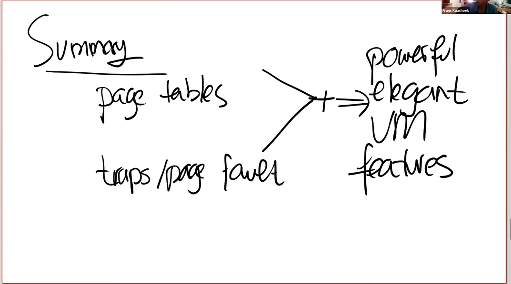

# Memory Mapped files

[toc]

这节课最后要讨论的内容，也是后面的一个实验，就是memory mapped files。其核心思想是将整个files或者部分files加载到内存中去，这样通过内存虚拟地址就可以使用load或者store指令来操纵文件了。为了支持这个功能，大多数现代操作系统提供了一个叫mmap的系统调用。这个系统调用接收一个虚拟内存地址va，长度len，protection，flags，一个打开的文件描述符，和偏移量offset。

.png)

意思就是，让你将这个文件描述符对应的文件fd，从偏移量offset开始，将长度len的内容映射到虚拟地址va，同时我们需要加上一些保护，比如只读或者读写。

假设文件内容是可读写的，内核实现mmap的方式是eager mode的。内核会从文件的offset位置开始，将数据拷贝到内存，设置好PTE指向物理内存的位置。之后应用程序就可以使用load或者store指令来修改内存中对应的文件的内容了。当完成操作之后，还有一个unmap（va，len）的系统调用，用来表明应用程序已经完成了对这个文件的操作，在unmap时间点，我们需要将dirty block写回到文件中。我们可以很容易的找到哪些block是dirty的，因为它们对应的PTE的dirty bit为1。

.png)

当然，在任何聪明的内存管理机制中，所有的这些都是以lazy的方式实现。你不需要立即将文件内容拷贝到内存中，只需要先记录一下即可，比如这个PTE属于这个文件描述符。相应的信息存储在VMA结构体中，VMA aka Virtual Memory Area。例如对于这个文件描述符f，会有一个VMA，在VMA中会记录文件描述f，偏移量等等，这些信息用来表示对应的内存虚拟地址的实际内容在哪，这样当我们得到一个位于VMA地址范围的page fault时，内核可以从磁盘中读数据，并加载到内存中。所以这里回答了之前的一个问题，dirty bit位是很重要的。因为在unmap系统调用中，你需要向文件回写dirty block。

>学生提问：有没有可能多个进程将同一个文件映射到内存，然后会有同步的问题？
>
>Frans回答：这个问题等价于多个进程同时对一个文件描述符执行read/write系统调用会怎么样？
>
>这里的行为是不可预知的，write系统调用会以某种顺序出现，如果两个进程向同一个文件的block写数据，要么第一个进程的write能生效，要么第二个进程的write能生效，只能是两者之一生效。在这里其实也是一样的，所以我们并不需要考虑冲突的问题。
>
>一个更加成熟的Unix操作系统支持锁定文件，你可以先锁定文件，这样就能保证数据同步。但是默认情况下，并没有同步保证。
>
>学生提问：mmap的参数中，len参数是干嘛的，flag参数又是干嘛的？
>
>Frans回答：len表示你要加载到内存中的字节数的长度，prot是read/write。flags会在mmap lab中出现，我认为它表示了这个区域是私有的还是共享的。如果是共享的，那么这个区域可以在多个进程之间共享。
>
>学生提问：果其他进程直接修改了文件的内容，那么是不是意味着修改的内容不会体现在这里的内存中？
>
>Frans回答：是的。但是如果文件是共享的，那么你应该同步这些变更。我记不太清楚在mmap中，文件共享时会发生什么。

你们会在file system lab之后做这里相关的mmap lab，这将会是我们最后一个虚拟内存实验。

最后我们来总结一下本节课内容，我们首先详细看了下page table的工作机制，之后又详细看了一下trap是如何工作的。page fault机制结合了上面这两部分的内容，可以更加优雅地实现虚拟内存的功能。我们这节课介绍的内容，只是操作系统里面基于page fault功能的子集。

一些成熟的操作系统都实现了今天我们所讨论的内容，比如Linux，它包含了所有的内容，还有额外有趣的功能。希望今天的课程给你一个好的理解，你可以在page fault handler中动态的更新page table使得虚拟内存的功能变得更加强大。

