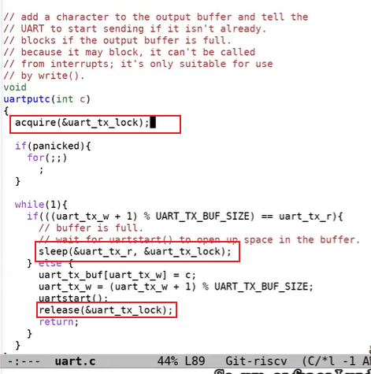

# UART驱动的bottom部分

[toc]

在我们向console输出字符时，如果发生了中断，RISC-V会做什么操作？我们之前已经在SSTATUS寄存器中打开了中断，所以处理器会被中断。假设键盘生成了一个中断并且发向了PLIC，PLIC会将中断路由给一个特定的CPU核，并且如果这个CPU核设置了SIE寄存器的Ebit（注，针对对外部中断的bit位），那么会发生以下事情：

* 首先，会清除SIE寄存器相应的bit，这样可以阻止CPU核被其他中断打扰，该CPU核可以专心处理当前中断。处理完成之后，可以再次恢复SIE寄存器相应的bit。

* 之后，会设置SEPC寄存器为当前的程序计数器。举个例子，假设shell正在用户空间运行，突然来了一个中断，那么当前shell的程序计数器会被保存。

* 之后，要保存当前的mode。在我们的例子里面，因为当前运行的是Shell程序，所以会记录user mode。

* 再将mode设置为Supervisor mode。

* 最后将程序计数器中的值设置成STVEC的值。（注，STVEC用来保存trap处理程序的地址，详见Lec06）在xv6中STVEC中的值要么是uservec或者kernelvec函数的地址，具体取决于发生中断时程序运行在user space还是kernel space。在我们的例子中，shell运行在user space，所以STVEC保存的是uservec函数的地址。而从之前的课程我们可以知道uservec函数会调用usertrap函数。我们这节课不会介绍trap过程中的保存，恢复过程，因为在之前的课程中已经详细的介绍过了。

  .png)

接下来看一下trap.c文件中usertrap函数，我们在lec06和lec08分别在这个函数中处理了system call和page fault。今天我们将要看一下如何处理中断。

.png)

在trap.c的devintr函数中，首先会通过SCAUSE寄存器判断中断是否来自于external device。如果是的话，再调用plic_claim函数来获取中断。

%20(1)%20(1)%20(1).png)

plic_claim函数位于plic.c文件中。在这个函数中，当前CPU核会告知PLIC，自己要处理中断，PLIC_SCLAIM会将中断号返回，对于UART来说，返回的中断号是10。

.png)

从devintr函数可以看出，如果是UART中断，那么会调用uartintr函数。位于uart.c文件的uartintr函数，会从UART的接受寄存器中读取数据，之后将获取到的数据传递给consoleintr函数。哦，我搞错了，我们现在讨论的是向UART发送数据。因为我们现在还没有通过键盘输入任何数据，所以UART的接受寄存器现在为空。

.png)

所以代码会直接运行到uartstart函数，这个函数会将Shell存储在buffer中的任意字符送出。实际上在提示符`$`之后，Shell还会输出一个空格字符，write系统调用可以在UART发送提示符`$`的同时，并发的将空格字符写入到buffer中。所以UART的发送中断触发时，可以发现在buffer中还有一个空格字符，之后会将这个空格字符送出。

这样，驱动的top部分和bottom部分就解耦开了。

>学生提问： UART对于键盘来说很重要，来自于键盘的字符通过UART走到CPU再到我们写的代码。但是我不太理解UART对于Shell输出字符究竟有什么作用？因为在这个场景中，并没有键盘的参与。
>
>Frans教授：显示设备与UART也是相连的。所以UART连接了两个设备，一个是键盘，另一个是显示设备，也就是Console。QEMU也是通过模拟的UART与Console进行交互，而Console的作用就是将字符在显示器上画出来。

（注，以下问答来自课程结束部分，与本节内容时间上并不连续）

>学生提问：uartinit只被调用了一次，所以才导致了所有的CPU核都共用一个buffer吗？
>
>Frans教授：因为只有一个UART设备，一个buffer只针对一个UART设备，而这个buffer会被所有的CPU核共享，这样运行在多个CPU核上的多个程序可以同时向Console打印输出，而驱动中是通过锁来确保多个CPU核上的程序串行的向Console打印输出。
>
>学生继续问：所以说，就是一次只有一个CPU的核会用UART对吧？
>
>教授回答：是的，这有点复杂，我们看下uartputc函数，首先你会看到`acquire（&uart_tx_lock）`这行代码。当有很多CPU的核试图把一个字符放入buffer中时，只有一个会得到锁，其他的不会。得到锁的进入下面的代码，查看write指针，写入字符到buffer释放锁，或者因为buffer满了直接sleep。
>
>

>学生提问：我们之所以需要锁是因为有多个CPU核，但是却只有一个Console，对吧？
>
>Frans教授：是的，如我们之前说的驱动的top和bottom部分可以并行的运行。所以一个CPU核可以执行uartputc函数，而另个一CPU核可以执行uartintr函数，我们需要确保它们是串行执行的，而锁确保了这一点。
>
>学生提问：那是不是意味着，某个时间，其他所有的CPU核都需要等待某一个CPU核的处理？
>
>Frans教授：这里并不是死锁。其他的CPU核还是可以在等待的时候运行别的进程。如果有多个CPU的核尝试调用uartputc函数，而此时buffer是满的。那么当中断发生时，它们会释放锁。
>
>仔细看代码，在uartputc函数中当buffer是满的时候执行`sleep(&uart_tx_r, &uart_tx_lock);`注意第二个入参，sleep函数在将进程真的sleep之前，会先释放uart_tx_lock锁的，
>
>学生又问：当UART触发中断的时候，所有的CPU的核都能收到中断吗？
>
>教授答：对于xv6来说，所有的CPU都能收到中断，但是只有一个声明拿到这个Interrupt，那个CPU的特定的core会得到IRQ，然后PLIC会记得这个IRQ正在被处理所以不会给别人了。这通过PLIC编程可以确定nterrupt的分配机制。

>
>
>