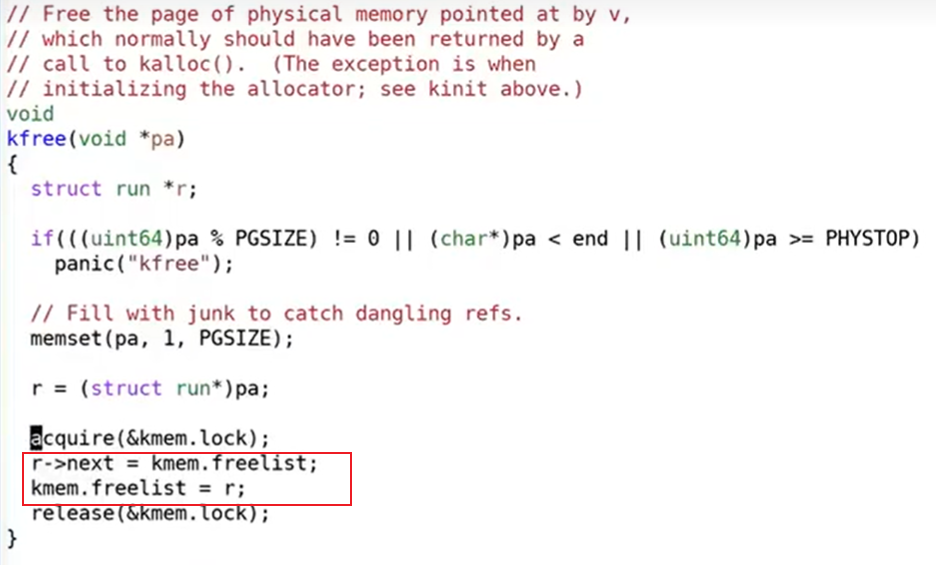

# 锁如何避免race condition

[toc]

首先你们在脑海里应该有多个CPU核在运行，比如说CPU0在运行指令，CPU1也在运行指令，这两个CPU核都连接到同一个内存上。数据freelist位于内存中，它里面记录了2个内存page。假设两个CPU核在相同的时间调用kfree。

.png)

kfree函数接收一个物理地址pa作为参数，freelist是个单链表，kfree中将pa作为单链表的新的head节点，并更新freelist指向pa(注，也就是将空闲的内存page加在单链表的头部)。当两个CPU都调用kfree时，CPU0像要释放一个page，CPU1也想要释放一个page，现在这两个page都需要加到freelist中。

.png)

kfree中首先将对应内存page的变量r指向了当前的freelist（也就是单链表当前的head节点）。我们假设CPU0先运行，那么CPU0会将它的局部变量r的next指向当前的freelist。如果CPU1恰好在同一时间运行，它可能在CPU0运行第二条指令（kmem.freelist=r）之前运行代码。所以它也会完成相同的事情，它也会将自己的变量r的next指向当前的freelist。现在两个物理page对应的变量r都指向了同一个freelist（注，也就是原来单链表的head节点）。

%20(2)%20(2)%20(2).png)

接下来，剩下的代码也会并行的执行（kmem.freelist = r）,这行代码会更新freelist为r。

因为我们这里只有一个内存，所以总是有一个CPU会先执行，另一个后执行。我们假设CPU0先执行，那么freelist会等于CPU0的变量r。之后CPU1再执行，它又会将freelist更新为CPU1的变量r。这样的结果是，我们丢失了CPU0对应的page。CPU0想要释放的内存page最终没有出现在freelist数据中。

上面说的是一种坏的情况，当然还有更坏的情况，因为可能会有更多的CPU，例如第三个CPU可能即CPU2会短暂的发现freelist对等CPU0的那个r，并且用了这个page，但是之后很快freelist又被CPU1给更新了。所以，拥有越多的CPU，我们就可以看到比丢失page更奇怪的现象。

在代码中，解决这种问题的方式就是使用锁。

接下来让我具体的介绍一下锁。锁就是一个对象，就像其他在内核中的对象一样。有一个结构体叫lock，它包含了一些字段，这些字段中维护了锁的状态。锁又非常直观的API：

acquire：接收指向lock的指针作为参数，acquire确保了在任何时间，只会有一个进程能够成功获取锁。

release：也接收指向lock的指针作为参数，在同一时间尝试获取锁的其他进程需要等待，直到持有锁的进程对锁调用release。

.png)

锁的acquire和release之间的代码，通常被称为critical section。

.png)

之所以被称为critical section，是因为通常会在这里以原子的方式对共享数据进行更新。所以基本上来讲，如果在acquire和release之间有多条命令，它们要么会一起执行，那么一条也不会执行。所以永远也不可能看到位于critical section中的代码，如同在race condition中一样在多个CPU上交织的执行，所以这样就能避免race condition。

现在的程序通常会有很多锁，xv6中就有很多锁。为什么会有这么多锁，因为锁序列化了代码的执行，如果两个核想要进入到同一个critical section中，只会有一个能成功进入，另一个核会在第一个处理器从critical section中退出之后再进入。所以这里完全没有并行执行。

如果内核中有一个大锁，我们暂时将其称为big kernel lock。基本上所有的系统调用都会序列化执行：System call 1获取big kernel lock然后开始执行自己的操作，完成之后释放big kernel lock，再返回自己的user space。然后下一个System call在继续执行。

这样的话，如果我们有一个应用程序并行的调用了很多系统调用，这些系统调用会串行的执行，因为我们只有一把锁。所以通常来说，xv6会有很多把锁，因为这样的话可以获得某种程度的并发执行。比如说，两个不同的系统调用，使用两个不同的锁，那么这两个系统调用完全可以并行执行，而不需要序列化。

.png)

这里有几点很重要：

首先没有强制说一定要使用锁，锁的使用完全由程序员决定。如果你觉得一段特定的代码需要具备原子性，那么其实是由程序员决定是否增加锁的acquire和release。

其次代码不会自己自动加锁，程序员需要自己确定是否将锁与特定的数据结构相关联，并在适当的位置增加锁的API acquire与release。