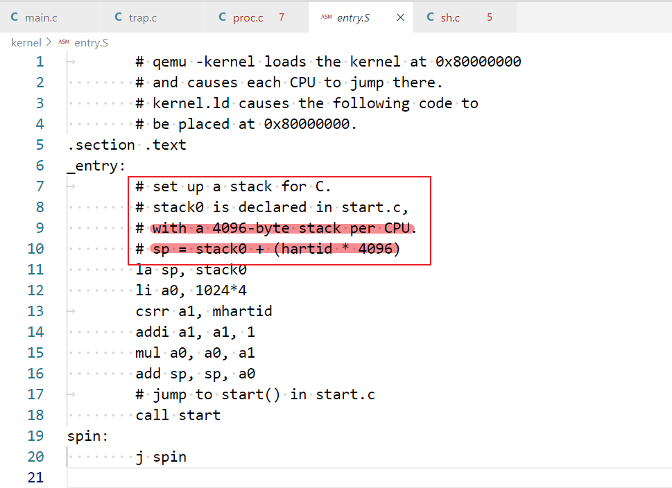

# xv6线程切换 --- swtch函数

[toc]

%20(2)%20(2)%20(2).png)

swtch函数会将当前的内核线程的寄存器保存到p->context中。swtch函数的另一个参数c->context，c表示当前CPU的结构体。CPU结构体中的context保存了当前CPU核的线程调度器线程（scheduler thread）的寄存器。所以swtch函数在保存完当前内核线程的内核寄存器之后，就会恢复当前CPU的线程调度器的寄存器，然后继续执行当前CPU的线程调度器。

接下来，我们快速的看一下我们将要切换到的context（注，也就是调度器线程的context）。因为我们只有一个CPU核，这里我在gdb中print cpus[0].context

.png)

这里看到就是之前保存的当前CPU的线程调度器的寄存器，里面最有意思的就是RA寄存器，它保存的是当前函数的返回地址，所以说，这个CPU的线程调度器（scheduler thread）线程会返回到RA寄存器的地址，我们可以通过查看kernel.asm来看下这个0x80001f2e到底是啥？

也可以在gdb中输入“x/i 0x80001f2e”进行查看。

.png)

输出中包含了指令和指令所在的函数名。所以我们要返回到scheduler函数中。

因为接下来要调用swtch函数，让我们看看swtch到底做了什么，swtch函数位于swtch.S文件中

.png)

ra寄存器被保存在了a0寄存器指向的地址上。a0寄存器是swtch函数的第一个参数，就是&p->context；a1寄存器是swtch函数第二个参数，就是&c->context。从前面可以看出&c->context这是即将要切换到的调度器线程的context对象地址。

所以函数中上半部分是将CPU硬件上的当前的寄存器保存在当前进程p->context对象中，函数的下半部分是将scheduler thread的寄存器从c->context中取出来然后load到硬件CPU上。之后函数就返回了。所以scheduler thread的ra寄存器就很有意思了，因为只要执行ret指令，pc就会跳到ra寄存器指向的地址开始执行，而ra的地址我们刚才看了是0x80001f2e，是在scheduler函数里面。

这里有个有趣的问题，或许你们已经注意到了。swtch函数的上半部分保存了ra，sp等等寄存器，但是并没有保存程序计数器pc（Program Counter），为什么会这样呢？

> 学生回答：因为程序计数器不管怎样都会随着函数调用更新。

是的，程序计数器并没有有效的信息，我们现在知道我们在swtch函数中执行，但是我们关心的是我们是从哪调用进到swtch函数的（PS：但是我们更关心当执行完swtch函数之后我们会回到哪里。ra寄存器保存了swtch函数的调用点，正常是会回到调用swtch函数的指令的下一条继续执行）

因为当我们通过switch恢复执行当前线程并且从swtch函数返回时，我们希望能够从调用点继续执行。ra寄存器保存了swtch函数的调用点，所以这里保存的是ra寄存器。我们可以打印ra寄存器，如你们所预期的一样，它指向了sched函数。

.png)

一个问题是，为什么RISC-V中有32个寄存器，但是swtch函数中只保存并恢复了14个寄存器？

>学生回答：因为swtch函数是按照一个普通的C函数来调用的，对于有些寄存器，swtch函数的调用者会默认swtch函数会对其进行修改，所以调用者自己（sched函数，scheduler函数）已经在自己的stack上对其做了保存，当函数返回时，这些寄存器会自动恢复。所以swtch函数里只保存callee saved register就行。

完全正确，因为swtch函数是从C代码调用的，所以我们知道caller saved register会被C编译器保存在当前的stack上。caller saved register大概有15-18个，而我们在swtch函数中只需要处理C编译器不会保存，但是对于swtch函数又有用的一些寄存器。所以在进行线程切换的时候，我们只需要保存callee saved register就行了。

（PS：这里面跟user process陷入内核，然后将所有的寄存器几乎都保存在trapframe有些不同，因为无法保证user process是个C语言程序，其遵守C 编译器一样的规则，将寄存器分成caller/callee saved register）

最后我想看的是sp（Stack Pointer）寄存器。

.png)

从它的值很难看出它的意义，它实际是当前进程的内核栈地址，它由虚拟内存系统映射在了一个高地址。

现在，我们已经保存了当前CPU上的寄存器，并从线程调度器（scheduler thread）的context中回复了寄存器，我直接跳转到swtch函数的最后，也就是ret指令的位置

.png)

在我们实际返回之前，我们再来打印一些有趣的寄存器。首先sp寄存器有了一个不同的值，

.png)

sp寄存器此时的值在内存中stack0的区域中，这个区域实际上是在启动顺序中非常非常早的一个位置，start.S在这个区域创建了stack结构，这样才可以调用第一个C函数。

所以scheduler thread运行在CPU对应的boot stack上。如下图所示

其次是ra寄存器

.png)

现在ra寄存器指向了scheduler函数，因为我们恢复了调度器线程的context对象中的内容。

现在其实我们已经在scheduler thread里面了，现在硬件CPU上的寄存器的值已经完全不一样了。虽然我们还在swtch函数里面，因为还没有执行ret指令，但是我们实际上是在scheduler函数调用的swtch函数里面。接下来通过执行ret指令，我们就可以返回到调度器线程中。

（注，以下提问来自于课程结束部分，因为相关所以移到这里）

> 学生提问：我不知道我们使用的RISC-V处理器是不是有一些其他的状态？但是我知道一些Intel的X86芯片有floating point unit state等其他的状态，我们需要处理这些状态吗？
>
> Robert教授：你的观点非常对。在一些其他处理器例如X86中，线程切换的细节略有不同，因为不同的处理器有不同的状态。所以我们这里介绍的代码非常依赖RISC-V。其他处理器的线程切换流程可能看起来会非常的不一样，比如说可能要保存floating point寄存器。我不知道RISC-V如何处理浮点数，但是XV6内核并没有使用浮点数，所以不必担心。但是是的，线程切换与处理器非常相关。
>
> 学生提问：为什么swtch函数要用汇编来实现，而不是C语言？
>
> Robert教授：C语言中很难与寄存器交互。可以肯定的是C语言中没有方法能更改sp、ra寄存器。所以在普通的C语言中很难完成寄存器的存储和加载，唯一的方法就是在C中嵌套汇编语言。所以我们也可以在C函数中内嵌switch中的指令，但是这跟我们直接定义一个汇编函数是一样的。或者说swtch函数中的操作是在C语言的层级之下，所以并不能使用C语言。