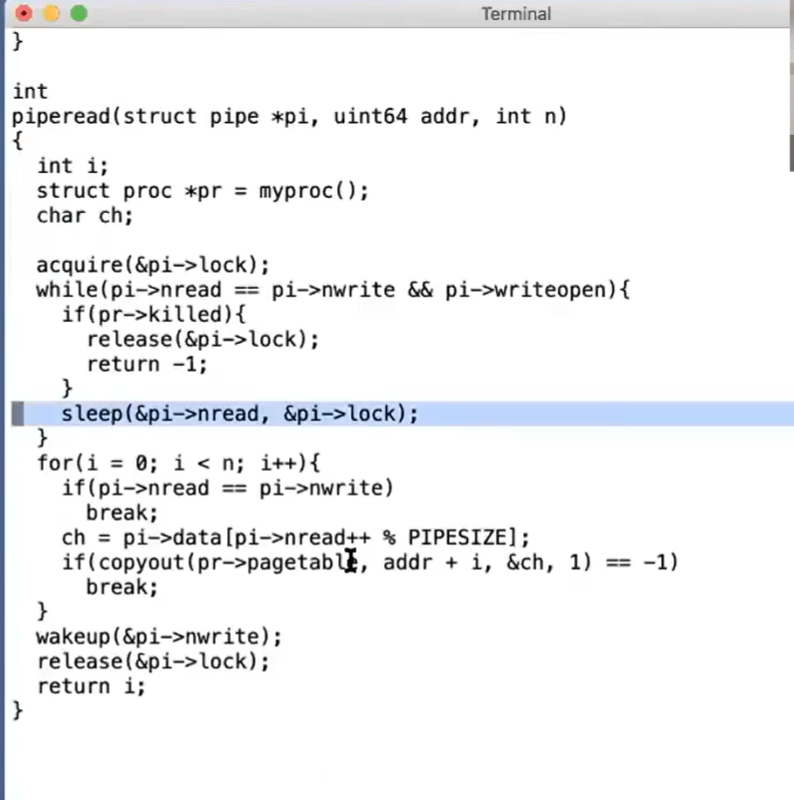
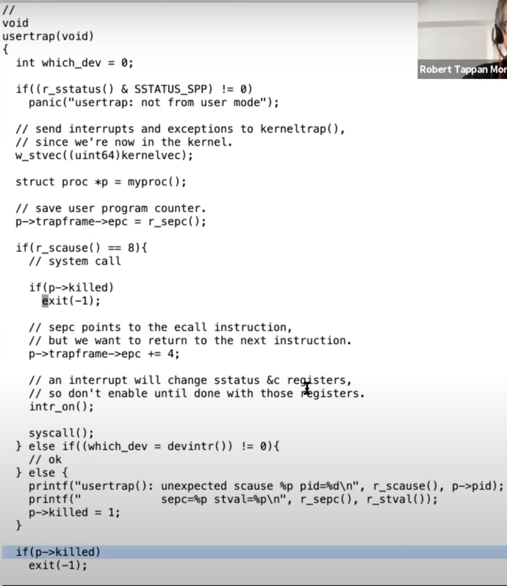

# kill系统调用

最后我们看下kill系统调用，UNIX系统重，允许一个进程将另外一个进程的ID传递给kill系统调用，目的是让ID对应的进程停止运行。如果我们不注意的话，kill了一个正在执行内核线程的进程，会有一些我刚才提到的风险，比如它正在更新file System，创建一个file，我们不能就这样杀死这个进程，因为这样会使得很多工作质完成了一部分。

所以kill系统调用不能就直接停止目标进程的运行。实际上，xv6和UNIX风格的操作系统重，kill系统调用基本上啥都没干。

.png)

从上图代码看，它就是扫描进程表单，将p->killed=1标志位设置1，。如果进程正在SLEEPING状态，将其设置为RUNNABLE。这里只是将killed标志位设置为1，并没有停止进程的运行。所以kill系统调用本身还是很温和的。

而目标进程运行到内核代码中能安全停止运行的位置时，会检查自己的killed标志位，如果设置为1，目标进程会自愿的执行exit系统调用。你可以在trap.c中看到所有可以安全停止运行的位置。

.png)

usertrap函数中有两处检查killed字段

* 在一个系统调用引起的usertrap函数中，在实际执行System call的内核实现函数之前，进程会自己先检查killed字段，如果已经被kill了，进程会自己调用exit。在这个位置，内核代码此时没有持有任何锁，也没有干什么重要的事情，所以此时调用exit时很安全的。

* 在usertrap函数结尾处，也有检查killed字段的代码，意思是在完成了系统调用的实际执行，进程依旧会检查自己是否被kill了。而且此处的检查killed的代码，对于Interrupt引起的usertrap函数也是生效的。例如当一个定时器中断打断了进程的运行，我们可以通过检查发现进程是killed状态，之后进程会调用exit退出。

kill系统调用并不是真正立即停止目标进程的执行，它更像是这样：

* 如果此时进程在用户空间，那么当它下一次进行系统调用时候，内核线程会自动调用exit。

* 如果此时进程在用户空间，下一次的timer Interrupt或者别的中断都会导致内核线程执行exit，

所以从一个进程调用kill系统调用，到目标进程真正被干掉了，中间可能有很明显的延时。

这里有个问题没有说明白，就是目标进程可能不在user space；如果它正在执行系统调用过程中，然后它被kill了，我们需要做什么特殊的操作吗？之所以提这个问题，进程是从console中读取即将输入的字符的，而你可能要明天才会输入一个字符，所以当你kill一个进程时，最好进程不是等到明天才退出。

出于这个原因，在XV6的很多位置中，如果进程在SLEEPING状态时被kill了，进程会实际的退出。让我来给你展示这里的机制。

首先要看的是kill函数

.png)

你可以看到如果目标进程是SLEEPING状态，kill函数会将其状态设置为RUNNABLE，这意味着，即使之前的进程调用了sleep进入SLEEPING状态，scheduler thread仍会重新调度并执行该进程，并且该进程会从sleep函数中返回。让我们来查看一下这在哪生效的。在pipe.c的piperead函数中，

如果一个正在sleep状态等待从pipe中读取数据，然后它被kill了。kill函数会将其状态设置为RUNNABLE，之后进程会从sleep函数中返回，返回之后人就在while循环里面，因为此时pipe中还是没有数据，仔细看代码，此时piperead函数会检查进程是否被kill了（注，if(pr->killed)）。如果进程被kill了，那么接下来piperead函数会返回-1，并且直接回到usertrap函数的syscall()位置，因为piperead就是read系统调用的内核实现。

之后在usertrap函数中会检查p->killed，并调用exit。

所以对于SLEEPING状态的进程，如果它被kill了，它会被直接唤醒，包装了sleep的循环会检查进程的killed标志位，最后再调用exit。

同时还有一些情况，如果进程在SLEEPING状态中kill了并不是直接退出。例如，一个进程正在更新一个文件系统并创建一个文件，进程不适宜在这个时间点退出，因为我们想要完成文件系统的操作，之后进程才能退出。我会向你展示一个磁盘驱动中的sleep循环，这个循环中就没有检查进程的killed标志位。

下面就是virtio_disk.c文件中的一段代码：

%20(1)%20(1).png)

这里一个进程正在等待磁盘的读取结束，这里没有检查进程的killed标志位。因为现在可能正在创建文件的过程中，而这个过程涉及到多次读写磁盘。我们希望完成所有的文件系统操作，完成整个系统调用，之后再检查p->killed并退出。

> 学生提问：为什么一个进程允许kill另一个进程？这样一个进程不是能杀掉所有其他进程吗？
>
> Robert教授：如果你在MIT的分时复用计算机Athena上这么做的话，他们可能会开除你。在XV6中允许这么做是因为，XV6这是个教学用的操作系统，任何与权限相关的内容在XV6中都不存在。在Linux或者其他真正的操作系统中，每一个进程都有一个user ID，一些系统调用使用进程的user ID来检查进程允许做的操作。
>
> 所以在Linux中会有额外的检查，调用kill的进程必须与被kill的进程有相同的user id，否则的话，kill操作不被允许。所以，在一个分时复用的计算机上，我们会有多个用户，我们不会想要用户kill其他人的进程，这样一套机制可以防止用户误删别人的进程。
>
> 学生提问：init进程会退出吗
>
> Robert教授：让我们来看看

.png)

>是的，如果fork失败了，init进程也会退出。不过，这个问题的真正的答案是，不会退出。init进程的目标就是不退出，在一个for循环里面不停地调用wait函数。如果init进程退出了，我认为这是一个Fatal级别的错误，然后系统会崩溃。在exit函数的最开始就会有如下检查

.png)

>如果调用exit的进程是init进程，那么会触发panic。因为如果没有init进程的话，系统最终还是会停止运行。如果没有init进程的话就没有人会为退出的进程调用wait系统调用，也就没有人完成进程资源的释放工作，我们最终会用光所有的进程，并引起一些其他的错误，所以我们必须要有init进程。所以这个问题的真正答案是init进程不允许退出。

>学生提问：这节课可能没有怎么讲到，但是如果关闭一个操作系统会发生什么？
>
>Robert教授：这个过程非常复杂，并且依赖于你运行的是个什么操作系统。因为一般的file System是持久化的，它能在多次重启之间保持数据，我们需要保持文件系统的良好状态，如果我们正在更新文件系统，例如创建文件，然后我们想关闭操作系统，断电之类的。我们需要一个策略来保证即使我们处在一个复杂的更新文件系统的过程中，我们并不破坏磁盘上的文件系统数据。文件系统其实就是一个位于磁盘的数据结构。所以这里涉及到了很多的机制来保证如果你关闭操作系统或者断电了，我们可以恢复磁盘上的文件系统。
>
>其他的，你需要做一些特殊操作来关闭操作系统，这取决于你正在运行什么进程。如果你正在运行一些重要的服务器，例如数据库服务器，并且很多其他计算机依赖这个数据库，并通过网络使用它。那谁知道呢？答案或许是你不能就这么直接的关闭操作系统，因为你正在提供一个对于其他计算机十分重要的关键服务。
>
>如果你的计算机并没有做任何事情，那么你可以直接关了它。或许对于你的问题来说，如果你想关闭一个计算机，确保文件系统是正确的，之后停止执行指令，就可以关闭计算机了。

> 学生提问：什么是semaphora
>
> Robert回答：P & V。