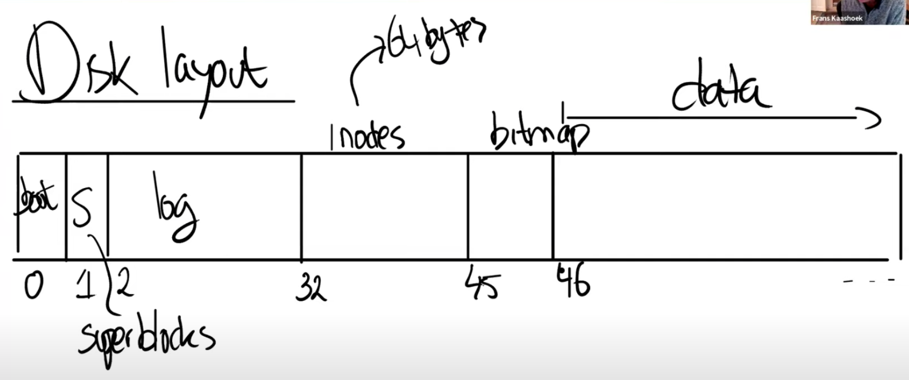

# File system 工作演示

接下来我们看一下实际中，XV6的文件系统是如何工作的，这部分内容对于下一个lab是有帮助的。

首先我会启动XV6（先`make clean`再`make qemu`），这里有件事情我想指出。启动XV6的过程中，调用了makefs指令，来创建一个文件系统。

.png)

所以makefs创建了一个全新的磁盘镜像，在这个磁盘镜像中包含了我们在指令中传入的一些文件。makefs为你创建了一个包含这些文件的新的文件系统。

XV6总是会打印文件系统的一些信息，所以从指令的下方可以看出有46个meta block，其中包括了：

* boot block
* super block
* 30个log block
* 13个inode block
* 1个bitmap block

接下来是954个data block。所以这是一个袖珍级的文件系统。一共1000个block。在File system lab中，你们会去支持更大的文件系统。

我还稍微修改了一下xv6，使得任何时候写入block都会打印出block的编号。我们从console的输出可以看出，在XV6启动过程中，会有一些对于文件系统的调用，并写入了block 33，45，32。

接下来我们会运行一些命令，来看一下哪些命令会对哪些block做了写操作，并理解为什么要对这些block写入数据。我们通过`echo "hi" > x`命令来创建一个文件`x`，然后吸入字符`"hi"`。我把console的输出拷贝出来，并做分割以方便我们更好的理解。

.png)

这里会有几个阶段：

* 第一阶段是创建文件`x`
* 第二阶段是向文件`x`中写入`hi`
* 第三阶段是向文件`x`中写入`\n`换行符

你去看echo的代码。基本上就这三个步骤

.png)

上图就是echo的实现代码，它先检查入参，将入参写入到文件描述符1中，最后写一个换行符。

让我们按照3个阶段看echo的执行过程，并理解对于文件系统来说发生了什么。相比于看代码，直接看disk layout（磁盘布局）更方便我们理解。

你们觉得的write 33代表了什么？我们正在创建文件，所以我们期望文件系统干什么呢？

> 学生回答：这是在写inode

是的，看起来给我们分配的inode位于block 33。之所以有两个write 33，

* 第一个是为了标记inode将要被使用。在xv6中，我记得是使用inode中的type字段来标识inode是否空闲，这个字段同时也会用来表示inode是一个文件还是一个目录。所以这里将inode的type从空闲改成了文件，并写入磁盘表示这个inode已经被使用了。
* 第二个write 33就是实际的写入inode的内容。inode的内容会包含linkcount为1以及其他内容。

write 46是向第一个data block写数据，那么这个data block属于谁呢？

> 学生回答：属于根目录

是的，block 46是根目录的第一个block。为什么它需要被写入数据呢？

> 学生回答：因为我们正在向根目录创建一个新文件

是的，这里我们向根目录增加了一个新的entry，其中包含了文件名`x`，以及我们刚刚分配的inode number。

接下来的write 32又是什么意思呢？block 32保存的仍然是inode，那么inode中的什么发生了变化使得需要将更新后的inode写入磁盘？是的，根目录的大小变了，因为我们刚刚添加了16个字节的entry来代表文件x的信息。

最后又有一次write 33，我在稍后会介绍这次写入的内容，这里我们再次更新了文件x的inode，尽管我们还没有写入任何数据。

以上就是第一阶段创建文件的过程。第二阶段是向文件写入`"hi"`。

首先是write 45，这是更新bitmap。文件系统首先会扫描bitmap来找到一个还没有使用的data block，未被使用的data block对应bit 0。找到之后，文件系统需要将该bit设置为1，表示对应的data block已经被使用了。所以更新block 45是为了更新bitmap。

接下来的两次write 595表明，文件系统挑选了data block 595。所以在文件系统x的inode中，第一个direct block number是595。因为写入了两个字符`"hi"`，所以write 595被调用了两次。

第二阶段最后的write 33是更新文件x对应的inode中的size字段，因为现在文件x中有了两个字符。

>学生提问：block 595看起来在磁盘中很靠后了（一共1000个block），是因为前面的block已经被系统内核占用了吗？
>
>Frans教授：我们可以看前面的makefs指令，makefs存了很多文件在磁盘镜像中，这些都发生在创建文件x之前，所以磁盘中很大一部分已经被这些文件填满了。
>
>学生提问：第二阶段最后的write 33是否会将block 595与文件x的inode关联起来？
>
>Frans教授：会的，这里的write 33会发生几件事情：首先inode的size字段会更新；第一个direct block number会更新。这两个信息都会通过write 33一次更新到磁盘的inode中。

以上就是磁盘中文件系统的组织结构的核心，希望你们都能理解背后的原理。