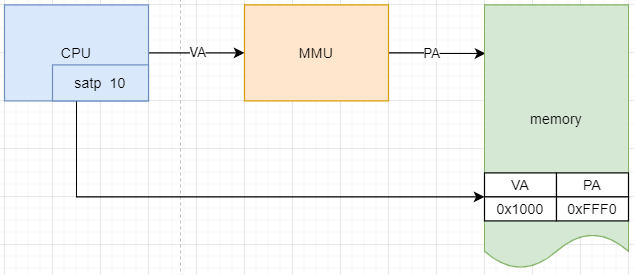
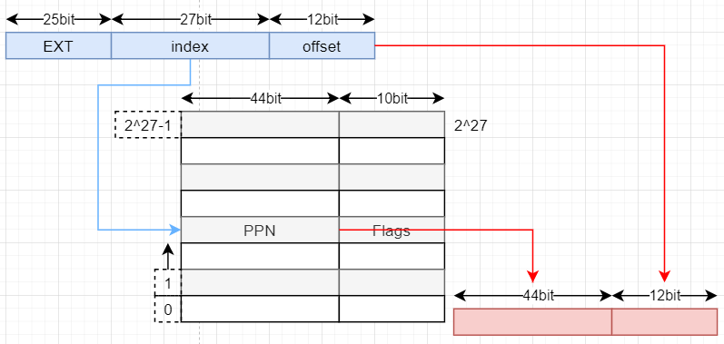

# Lecture 4 - Page Tables

[toc]

## 1 main object of this course

* address space
* RISC-V Hardware about page tables
* the source code about page tables in xv-6 system

## 2 address space

* address space的作用是什么？isolation(e.g.cat进程可能scribbling over shell进程的memory image)，但是如果每个进程，包括用户态进程与kernel（这里kernel就是个大进程）都拥有自己的独立的address space就可以避免这个问题，各自独立的address space的地址区间从[0, N]；N的大小与实际物理地址的最大值M没有必然联系。

* 联系Lab2里面的sysinfo作业，让计算空闲页表的大小（单位bytes）；会发现xv6内核负责这个的结构体是这个玩意儿

  ```c
  struct {
    struct spinlock lock;
    struct run *freelist;
  } kmem;
  ```

* how basically multiplex all these address spaces across a single physical memory?-Page Tables

这个图画的很好，github上面的课程翻译关于下面这个图的，要好好看下并抄写，核心思想是每个进程都有自己的`mapping（va--->pa的映射关系）`，这个`mapping`是给`MMU`或者`CPU`这些具有地址翻译功能的硬件用的，每个进程的这个`mapping`也是存在内存里面的，其`root address`存在每个`process`的`satp`寄存器里面，这里很好的印证了之前的思想，`process`是`CPU`的抽象。



* 虚拟地址到物理地址的换算公式

虚拟地址里面的`index`负责映射到`PPN(physical page number)`也就是映射到具体的`physical page`，`offset`则表示在`physical page`页中的具体偏移。



> **`index`是`27bit`的原因：**`index`的作用是找到`PPN(physical page number)`

> **`offset`是`12bit`的原因：**一个物理页的大小是`4096byte`正好是`2^12`，所以`offset`作为页内偏移必须`12bit`，这里可以知道物理页是一段在物理上连续的`4096byte`大小的内存，如果不连续那么`offset`就没有意义了

>**`PPN`是`44bit`的原因，同时也是物理地址`56bit`的原因：**
>
>Frans教授：这是由硬件设计人员决定的。所以RISC-V的设计人员认为`56bit`的物理内存地址是个不错的选择。可以假定，他们是通过技术发展的趋势得到这里的数字。比如说，设计是为了满足5年的需求，可以预测物理内存在5年内不可能超过`2^56`这么大。或许，他们预测是的一个小得多的数字，但是为了防止预测错误，他们选择了像`2^56`这么大的数字。这里说的通吗？很多同学都问了这个问题。
>
>**硬件设计人员为啥不直接选择`64bit`作为物理地址，非要选择`56bit`：**
>
>Frans教授：选择`56bit`而不是`64bit`是因为在主板上只需要`56`根线。

>**物理页表必须`4K`对齐的原因**
>
>这里加一个三级页面转换图，地址转换完全由硬件完成，比如MMU或者CPU

>**转译后备缓存器(Translation Lookaside Buffer TLB是什么**
>
>对于OS来说，switch page table 等价于 flush TLB(RISC-V命令是sfence_VMA)