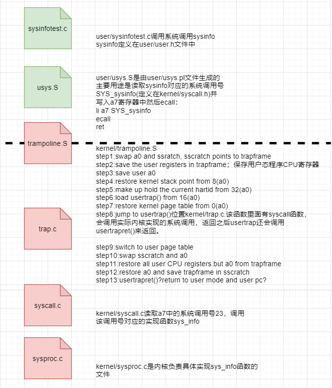
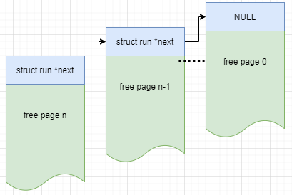

# 6.S801实验课-Lab2 system calls

[TOC]

## 1 前言

在之前实验Lab1中你已经利用system calls写了一些小工具应用。在本次实验中你将要为Xv6新增一些system calls，这将帮助你理解system calls是如何工作的，并且让你一窥Xv6内核的内部机制。在往后的实验中，你会被要求增加更多的system calls。

> 在你开始写代码之前，请认真阅读Xv6_book的第二章，与第四章中的4.3，4.4节，外加下面所列源码
>
> - system calls的用户空间源码是user/user.h与user/usys.pl
> - 内核空间源码是kernel/syscall.h与kernel/syscall.c
> - 进程相关的源码kernel/proc.h与kernel/proc.c

切换到syscall分支一边开始本次实验：

```bash
$ git fetch
$ git checkout syscall
$ make clean
```

此时如果你运行`make grade`命令，你会发现你的评分脚本无法执行trace与sysinfotest。你的工作就是为她们新增必须的system calls与stubs让她们可以顺利工作。

## 2 System call tracing(难度：中等)

> 在本次作业中你被要求写一个带有追踪特性的系统调用，这对debugging接下来的实验很有帮助。你要写一个`trace`系统调用来控制追踪过程。该系统调用需要有个入参，一个整形`mask`，通过其比特位来确定追踪哪些系统调用。比如说，追踪`fork`系统调用，一个程序调用`trace(1 << SYS_fork)`，这里面`SYS_fork`定义在`kernel/syscall.h`。你必须修改Xv6的内核，入参`mask`代表的系统调用返回时候打印其在程序中的行数。这个行数需要包含process id，系统调用的name，以及返回值；当然你不需要打印系统调用的参数。这个`trace`系统调用的作用范围包括调用她的process以及`fork`出来的子进程，但不会影响其他进程。

```bash
$ trace 32 grep hello README
3: syscall read -> 1023
3: syscall read -> 966
3: syscall read -> 70
3: syscall read -> 0
$
$ trace 2147483647 grep hello README
4: syscall trace -> 0
4: syscall exec -> 3
4: syscall open -> 3
4: syscall read -> 1023
4: syscall read -> 966
4: syscall read -> 70
4: syscall read -> 0
4: syscall close -> 0
$
$ grep hello README
$
$ trace 2 usertests forkforkfork
usertests starting
test forkforkfork: 407: syscall fork -> 408
408: syscall fork -> 409
409: syscall fork -> 410
410: syscall fork -> 411
409: syscall fork -> 412
410: syscall fork -> 413
409: syscall fork -> 414
411: syscall fork -> 415
...
$   
```

第一个例子中，trace调用grep程序来追踪read系统调用，这里面32就是`1 << SYS_read`。第二个例子中，trace调用grep来追踪所有的系统调用；这个2147483647就是31个低阶位全部被设置了。第三个例子中，没有程序被追踪，所有没有输出。第四个例子中，usertests程序中的forkforkfork测试中所有的`fork`系统调用都被追踪，也包括其子进程。你的答案如果跟上面的一样（process IDs除外）那应该就是正确的。

### 2.1 一些提示

* 在Makefile中的UPROGS加入`$U/_trace\`。

* 运行`make qemu`你会发现编译器没有编译`user/trace.c`，因为用户空间的stub不存在：

  > 在`user/user.h`中加入系统调用prototype； 
  >
  > 在`user/usys.pl`中加入stub；
  >
  > 在`kernel/syscall.h`中加一个syscall number；
  >
  > Makefile调用perl 脚本`user/usys.pl`生成`user/usys.S`，该文件是实际的system call stubs，stubs通过RISC-V的`ecall`命令进入kernel。一旦你解决了这个编译问题，你运行`trace 32 grep hello README`会直接失败，因为你还没有实现trace。

* 在`kernel/sysproc.c`文件中加入`sys_trace()`函数，该函数的实现需要在结构体proc中加一个新变量来记录其参数。通过参考`kernel/sysproc.c`文件中的其他例子可以看出，检查从user-space传来的参数的函数是在`kernel/sysproc.c`文件中。
* 修改`fork()`系统调用`kernel/proc.c`，保证trace mask从父进程拷贝到子进程。
* 修改`syscall()`函数`kernel/syscall.c`来打印trace的输出。你需要增加一个syscall_names的数组来记录调用的system calls。

### 2.2 实际操作

* 在`user/trace.c`中，写一个user-space program编译成可执行文件之后就叫trace。

* 在`Makefile`中的UPROGS加入`$U/_trace\`。

* 在`user/user.h`中添加`int trace(int);`系统调用声名；所有的user-space program调用system calls都声名在这里。

* 在`user/usys.pl`中加入stub；目的是生成`user/usys.S`，通过RISC-V的命令ecall进入kernel。

  > **问题1**：`user/usys.S`与`kernel/trampoline.S`之间的关系

* 在`kernel/syscall.h`中添加SYS_trace调用号，`user/usys.S`会把这个SYS_trace传给内核。

* 在`kernel/sysproc.c`中添加`sys_trace()`函数，负责trace系统调用的具体实现。

* 在`kernel/syscall.c`中修改`syscall()`函数，添加打印，这里需增加一个`syscall_names`数组。

* 在`kernel/proc.c`中修改`fork()`函数，保证trace_mask从父进程拷贝到子进程。

* 在`kernel/proc.h`中修改`strcut proc`结构体，加入新变量用于记录trace的入参。

  > **问题2**：`struct proc{}`结构体中包含`p->lock held 与 not held`两部分属性，trace系统调用的			入参应该加在哪部分？

### 2.3 提交并测评

```bash
eamonxia@ubuntu:~/Documents/XV6/xv6-labs-2020$ make GRADEFLAGS=trace grade
make clean
make[1]: Entering directory '/home/eamonxia/Documents/XV6/xv6-labs-2020'
......
make[1]: Leaving directory '/home/eamonxia/Documents/XV6/xv6-labs-2020'
== Test trace 32 grep == trace 32 grep: OK (2.0s)
== Test trace all grep == trace all grep: OK (0.6s)
== Test trace nothing == trace nothing: OK (0.9s)
== Test trace children == trace children: OK (9.1s)
```

## 3 Sysinfo(难度：中等)

在这个作业里面，你将被要求增加一个系统调用sysinfo，作用是搜集正在运行的系统的信息。这个系统调用只有一个入参：一个`struct sysinfo`的指针(`kernel/sysinfo.h`)。内核需要填充这个结构体：`freemem`这个字段代表可用的内存大小（单位`byte`），`nproc`字段代表当前运行状态不为`UNUSED`的进程的数量。我们提供了一个测试程序`sysinfotest`，运行之后显示`sysinfotest:OK`代表作业结果正确。

### 3.1 一些提示

* 在`Makefile`文件中`UPROGS`添加`$U/_sysinfotest`

* 运行`make qemu`；`user/sysinfotest.c`会编译失败。增加一个系统干调用`sysinfo`，步骤跟上个作业是一样的。需要先在`user/user.h`文件中声明`sysinfo()`。另外你需要提前声明结构体`struct sysinfo`的存在性：

  ```c
  struct sysinfo;
  int sysinfo(struct sysinfo *);
  ```

  一旦你解决了编译问题，运行`sysinfotest`还是会失败，这是因为你还没有在内核中实现`sysinfo`系统调用

* `sysinfo`系统调用需要将`struct sysinfo`结构体拷贝回用户空间；这里可以参考`sys_fstat()`位置`kernel/sysfile.c`与`filestat()`位置`kernel/file.c`这两个例子，看他们是如何使用`copyout()`的

* 搜集可用内存的数量，需要在`kernel/kalloc.c`文件中添加新函数

* 搜集现有进程的数量，需要在`kernel/proc.c`文件中添加新函数

### 3.2 实际操作

* 需要有一个用户态程序调用`sysinfo`系统调用，这里是`user/sysinfotest.c`已经有了

* 在`Makefile`文件中`UPROGS`添加`$U/_sysinfotest`

* 在`user/user.h`声明`int sysinfo(struct sysinfo *);`系统调用

  >  **问题3：**这里的`struct sysinfo`应该是在内核头文件中已经定义好了的，验证下

* 在`user/usys.pl`中加入stub；目的是生成`user/usys.S`，通过RISC-V的命令ecall进入kernel。

  > **重复问题1：**`user/usys.S`与`kernel/trampoline.S`之间的关系

* 在`kernel/syscall.h`中添加SYS_info调用号，`user/usys.S`会把这个SYS_info传给内核。

* 在`kernel/sysproc.c`中添加`sys_info()`函数，负责`sysinfo`系统调用的具体实现。
* 在`kernel/kalloc.c`中添加新函数，完成可用内存数量的搜集。
* 在`kernel/proc.c`中添加新函数，完成现有进程数量的搜集。

### 3.3 提交并测评

```bash
$ sysinfotest
sysinfotest: start
sysinfotest: OK
$
$ trace 8388608 sysinfotest
sysinfotest: start
11: syscall sysinfo -> 0
11: syscall sysinfo -> -1
11: syscall sysinfo -> 0
11: syscall sysinfo -> 0
11: syscall sysinfo -> 0
11: syscall sysinfo -> 0
11: syscall sysinfo -> 0
12: syscall sysinfo -> 0
11: syscall sysinfo -> 0
sysinfotest: OK
$
```

### 3.4 `sysinfo`系统调用设计的文件调用关系图：



### 3.5 `sysinfo`作业需添加代码明细

#### 修改`Makefile`文件

````makefile
diff --git a/Makefile b/Makefile
index dc75aa4..8b2642c 100644
--- a/Makefile
+++ b/Makefile
@@ -150,6 +150,7 @@ UPROGS=\
     $U/_wc\
     $U/_zombie\
     $U/_trace\
+    $U/_sysinfotest\
 ifeq ($(LAB),trap)
````

#### 修改`user/user.h`文件

* 添加`int sysinfo(struct sysinfo *);`系统调用的函数声明，用于给用户态程序调用。

```c
diff --git a/user/user.h b/user/user.h
index fdeeefc..83fe38a 100644
--- a/user/user.h
+++ b/user/user.h
@@ -1,5 +1,6 @@
 struct stat;
 struct rtcdate;
+struct sysinfo;
 // system calls
 int fork(void);
@@ -24,6 +25,7 @@ char* sbrk(int);
 int sleep(int);
 int uptime(void);
 int trace(int);
+int sysinfo(struct sysinfo *);
```

#### 修改`user/usys.pl`文件

添加`entry("sysinfo");`文件`user/usys.pl`用于生成`user/usys.S`汇编文件，该文件主要作用是将`SYS_sysinfo`系统调用号放到寄存器`a7`中，然后使用RISC-V命令`ecall`进入内核，主要是调到`trampoline.S`文件开头。

```c
diff --git a/user/usys.pl b/user/usys.pl
index 9c97b05..bc109fd 100755
--- a/user/usys.pl
+++ b/user/usys.pl
@@ -37,3 +37,4 @@ entry("sbrk");
 entry("sleep");
 entry("uptime");
 entry("trace");
+entry("sysinfo");
```

####  修改`kernel/defs.h`文件

在`/kernel/defs.h`文件中添加`struct sysinfo`与`void kgetfree(struct sysinfo*);`与`void getunusedproc(struct sysinfo*);`声明。

```c
diff --git a/kernel/defs.h b/kernel/defs.h
index 4b9bbc0..9f927a1 100644
--- a/kernel/defs.h
+++ b/kernel/defs.h
@@ -8,6 +8,7 @@ struct spinlock;
 struct sleeplock;
 struct stat;
 struct superblock;
+struct sysinfo;

 // bio.c
 void            binit(void);
@@ -63,6 +64,7 @@ void            ramdiskrw(struct buf*);
 void*           kalloc(void);
 void            kfree(void *);
 void            kinit(void);
+void            kgetfree(struct sysinfo*);

 // log.c
 void            initlog(int, struct superblock*);
@@ -104,6 +106,7 @@ void            yield(void);
 int             either_copyout(int user_dst, uint64 dst, void *src, uint64 len);
 int             either_copyin(void *dst, int user_src, uint64 src, uint64 len);
 void            procdump(void);
+void            getunusedproc(struct sysinfo*);

 // swtch.S
 void            swtch(struct context*, struct context*);

```

#### 修改`kernel/kalloc.c`文件

添加`void kgetfree(struct sysinfo *psi){...}`函数实现。

```c
diff --git a/kernel/kalloc.c b/kernel/kalloc.c
index fa6a0ac..8256de0 100644
--- a/kernel/kalloc.c
+++ b/kernel/kalloc.c
@@ -8,6 +8,7 @@
 #include "spinlock.h"
 #include "riscv.h"
 #include "defs.h"
+#include "sysinfo.h"

 void freerange(void *pa_start, void *pa_end);

@@ -80,3 +81,20 @@ kalloc(void)
     memset((char*)r, 5, PGSIZE); // fill with junk
   return (void*)r;
 }
+
+void
+kgetfree(struct sysinfo *psi)
+{
+    struct run * r;
+    uint64 counter = 0;
+
+    acquire(&kmem.lock);
+    r = kmem.freelist;
+    while(r) {
+        counter += PGSIZE;
+        r = r->next;
+    }
+    release(&kmem.lock);
+    psi->freemem =counter;
+}
```

#### 修改`kernel/proc.c`文件中

添加`void getunusedproc(struct sysinfo * psi){...}`函数实现。


```c
diff --git a/kernel/proc.c b/kernel/proc.c
index 81b3469..80ed4f6 100644
--- a/kernel/proc.c
+++ b/kernel/proc.c
@@ -5,6 +5,7 @@
 #include "spinlock.h"
 #include "proc.h"
 #include "defs.h"
+#include "sysinfo.h"

 struct cpu cpus[NCPU];

@@ -693,3 +694,16 @@ procdump(void)
     printf("\n");
   }
 }
+
+void
+getunusedproc(struct sysinfo * psi)
+{
+    struct proc *p;
+    uint64 counter = 0;
+
+    for(p = proc; p < &proc[NPROC]; p++) {
+        if(p->state != UNUSED)
+            counter++;
+    }
+    psi->nproc = counter;
+}

```

#### 修改`kernel/syscall.c`文件

添加`SYS_sysinfo`系统调用号对应的`sys_info`函数。

```c
diff --git a/kernel/syscall.c b/kernel/syscall.c
index cc2701a..bb15a18 100644
--- a/kernel/syscall.c
+++ b/kernel/syscall.c
@@ -105,6 +105,7 @@ extern uint64 sys_wait(void);
 extern uint64 sys_write(void);
 extern uint64 sys_uptime(void);
 extern uint64 sys_trace(void);
+extern uint64 sys_info(void);

 static uint64 (*syscalls[])(void) = {
 [SYS_fork]    sys_fork,
@@ -129,6 +130,7 @@ static uint64 (*syscalls[])(void) = {
 [SYS_mkdir]   sys_mkdir,
 [SYS_close]   sys_close,
 [SYS_trace]   sys_trace,
+[SYS_sysinfo] sys_info,
 };

 static char * syscalls_name[] = {
@@ -154,6 +156,7 @@ static char * syscalls_name[] = {
 [SYS_mkdir]   "mkdir",
 [SYS_close]   "close",
 [SYS_trace]   "trace",
+[SYS_sysinfo] "sysinfo",
 };
```

#### 修改`kernel/syscall.h`文件

添加`#define SYS_sysinfo 23`系统调用号定义。

```c
diff --git a/kernel/syscall.h b/kernel/syscall.h
index 0fb07ff..6a4d64b 100644
--- a/kernel/syscall.h
+++ b/kernel/syscall.h
@@ -21,4 +21,5 @@
 #define SYS_mkdir  20
 #define SYS_close  21
 #define SYS_trace  22
+#define SYS_sysinfo   23
```

#### 修改`kernel/sysproc.c`文件

添加`uint64 sys_info(void){...}`具体实现，是内核实现系统调用`sysinfo`的源码。

```c
diff --git a/kernel/sysproc.c b/kernel/sysproc.c
index f44f085..f6117c8 100644
--- a/kernel/sysproc.c
+++ b/kernel/sysproc.c
@@ -6,6 +6,7 @@
 #include "memlayout.h"
 #include "spinlock.h"
 #include "proc.h"
+#include "sysinfo.h"

 uint64
 sys_exit(void)
@@ -109,3 +110,28 @@ sys_trace(void)
     myproc()->trace_mask = trace_mask;
     return 0;
 }
+
+uint64
+sys_info(void)
+{
+    uint64 sysinfo_addr;
+    struct sysinfo si;
+    struct proc *p;
+
+    if(argaddr(0, &sysinfo_addr) < 0) {
+        printf("args problem\n");
+        return -1;
+    }
+
+    memset(&si, 0, sizeof(struct sysinfo));
+    kgetfree(&si);
+    getunusedproc(&si);
+
+    p = myproc();
+    if(copyout(p->pagetable, sysinfo_addr, (char *)&si, sizeof(si)) < 0) {
+        return -1;
+    }
+    return 0;
+}
```

## 4 一些问题汇总

### 问题1（X）：`user/usys.S`与`kernel/trampoline.S`之间的关系

* 答案不确定，RISC-V中的`ecall`命令，可以跳到`kernel/trampoline.S`文件的开头？

### 问题2（X）：`struct proc{}`结构体中包含`p->lock held 与 not held`两部分属性，

* 答案不确定，trace系统调用的入参应该加在哪部分？

###  问题3 （Y）：`struct sysinfo`应该是在内核头文件中已经定义好了的

> 答案：正常的使用方法是如下
>
> ```c
>//point.h
> #ifndef POINT_H
> #define POINT_H
> struct POINT{
> int x;
> int y;
> };
> #endif
> ```
> 
> ```c
>//1.c
> #include "point.h"
> struct POINT p1,p2,p3;
> ```
> 
> ```c
>//1.h（#ifndef之类的略）
> #include "point.h"
> extern struct POINT p1,p2,p3;
> ```
> 
> ```c
>//2.c
> #include "point.h"
> #include "1.h"
> //后面就可以用p1,p2,p3了。以后每个x.c都像这样用就可以了，全局变量在哪个x.c里定义的，就在与之对应的x.h里extern声名，以后要用到的每个头文件都include它。
> ```


### 问题4（X）：`struct sysinfo`内核与应用程序都能用？

作业sysinfo中的，内核函数`sys_info()`位于`kernel/sysproc.c`在自己的函数栈中声名一个局部变量`struct sysinfo si;`，内核函数`sys_info()`自己声名的变量，用着放心，然后调用`kgetfree(&si);`跟`getunusedproc(&si);`获取操作系统的信息，然后通过`copyout`将信息传给用户态程序，这样用户态程序只是传给内核一个地址，内核通过这个地址`copyout`回相应的信息。

### 问题5（Y）：结构体`struct run`的妙用

> ```c
> struct run {
> 	struct run *next;
> };
> ```
>
> 结合`freerange()`与`kfree`函数。
>
> ```c
> void freerange(void *pa_start, void *pa_end)
> {
>   char *p;
>   p = (char*)PGROUNDUP((uint64)pa_start);
>   for(; p + PGSIZE <= (char*)pa_end; p += PGSIZE)
>     kfree(p);
> }
> // Free the page of physical memory pointed at by v,
> // which normally should have been returned by a
> // call to kalloc().  (The exception is when
> // initializing the allocator; see kinit above.)
> void kfree(void *pa)
> {
>   struct run *r;
> 
>   if(((uint64)pa % PGSIZE) != 0 || (char*)pa < end || (uint64)pa >= PHYSTOP)
>     panic("kfree");
>   // 1.Fill with junk to catch dangling refs.
>   memset(pa, 1, PGSIZE);
>   // 2.cast the pa to (struct run*)
>   r = (struct run*)pa;
>   // 3.add the page to the kmem.freelist
>   acquire(&kmem.lock);
>   r->next = kmem.freelist;
>   kmem.freelist = r;
>   release(&kmem.lock);
> }
> ```
>
> `kfree`主要做了3件事：
>
> * 1、将释放的`page`写满`1`，这样防止`old valid contents`泄露；
> * 2、将`pa`也就是`page`的地址，强制转成`struct run *`类型指针；
> * 3、将释放的`page`加入到空白页列表中去；
>
> 这里2跟3很妙，`kmem.freelist`是内核维护的空白页链表，`kmem.freelist`链表中每个元素都是一个`struct run`结构体，这个结构体存储在哪里呢，答案是就存储在这些空白页中。
>
> 这也就是为啥2需要将`pa`强制转成`struct run*`指针`r = (struct run*)pa;`一个空白页上面写满了1，然后CPU将其看成一个`struct run`结构体，该结构体的第一个元素`struct run *next`指向下一个`struct run`结构体，也就是另一个空白页表。
>
> 

### 问题6（Y）：`PGROUNDUP`与`PGROUNDDOWN`宏，向上取整与向下取整。

> 这里面有个定理需要明确下2^n^二进制表示就是1+n个0；而2^n^-1的二进制表示为n个1；
>
> 那么4096的二进制表示就是1+12个0；而4096-1的二进制表示为12个1；
>
> 所以这里`& ~(PGSIZE-1)`其实就是`& 0000 0000 0000`与上12个0；
>
> 如此可以保证能被4096这种`1 0000 0000 0000`整除。
>
> ```c
> #define PGSIZE 4096 // bytes per page 2^12^
> 
> #define PGROUNDUP(sz)  (((sz)+PGSIZE-1) & ~(PGSIZE-1))
> #define PGROUNDDOWN(a) (((a)) & ~(PGSIZE-1))
> ```


### 问题7（X）：C语言写代码时候，组织架构问题

>`kernel/defs.h`中需要声名`struct sysinfo`
>
>`kernel/kalloc.c`中需要`#include "sysinfo.h"`
>
>`kernel/proc.c`中需要`#include "sysinfo.h"`
>
>`user/user.h`中需要`struct sysinfo`
>
>`user/sysinfotest.c`中需要`#include "kernel/sysinfo.h"`


### 问题8（Y）：gitbash中文显示Unicode问题

> gitbash中文显示出现无法解析的问题使用下面命令就可修复`git config --global core.quotepath false`
>
> ```bash
> xiayimin@xiayimin00 MINGW64 /d/work/GitHub/MIT6S801-LAB (main)
> $ git status
> 
> Changes not staged for commit:
> (use "git add <file>..." to update what will be committed)
> (use "git checkout -- <file>..." to discard changes in working directory)
> 		modified:   "6.S801\345\256\236\351\252\214\350\257\276-Lab2 system calls.md"
> no changes added to commit (use "git add" and/or "git commit -a")
> 
> xiayimin@xiayimin00 MINGW64 /d/work/GitHub/MIT6S801-LAB (main)
> $  git config --global core.quotepath false
> 
> xiayimin@xiayimin00 MINGW64 /d/work/GitHub/MIT6S801-LAB (main)
> $ git status
> 
> Changes not staged for commit:
> (use "git add <file>..." to update what will be committed)
> (use "git checkout -- <file>..." to discard changes in working directory)
> 
>      modified:   6.S801实验课-Lab2 system calls.md
> 
> no changes added to commit (use "git add" and/or "git commit -a")
> 
> ```
