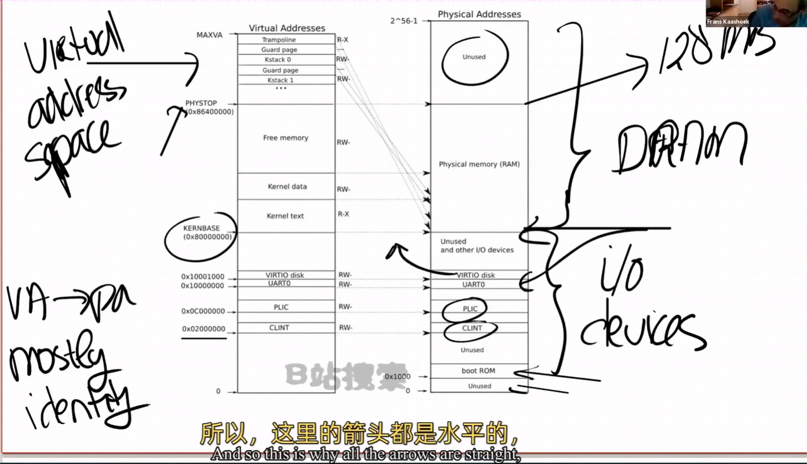

# b内核页表

[toc]

## 随堂笔记

先看kernel page table的分布，下图就是内核中地址的对应关系，左边是内核的虚拟地址，右边上半部分是物理内存或者说是DRAM，右边下半部分是I/O设备。

.png)

图中右半部分结构完全由硬件设计者决定。当操作系统启动时，会从0x80000000开始运行，这个地址也是硬件设计者决定的。看下RISC-V的板子，我们知道RISC-V的芯片有4个核，每个核都有自己的MMU与TLB，处理器边上是DRAM。

.png)

当完成地址翻译之后，如果PA的值大于0x80000000会走向DRAM，如果小于0x80000000会走向I/O设备。

可以通过阅读主板手册，了解物理地址对应关系。

.png)

.png)

首先0地址是保留的，地址0x10090000对应以太网，地址0x80000000对应DDR内存，即处理器外的易失内存（off-chip volatile memory）也就是DRAM芯片。

学生提问：当你说这里由硬件决定，硬件指的是CPU还是CPU所在的主板？

教授答：CPU只是主板的一小部分，DRAM芯片也位于处理器之外。主板设计者将处理器，DRAM，I/O设备汇总在一起，对于操作系统来说，CPU只是一部分，I/O设备同样很重要。当你写一个操作系统时，你需要同时处理CPU与I/O设备，比如你想想Internet发一个报文，操作系统需要调用网卡驱动来让网卡完成这个工作。

回到图右侧：物理地址的分布。可以看到最下面时未被使用的地址，与主板文档内容是一致的（地址为0）。地址0x1000是boot ROM的物理地址，主板上电，第一件事是运行boot ROM中的源码，当boot ROM完成之后，会跳转到0x80000000，操作系统需要确保那个地址有一些数据能够接着启动操作系统。

.png)

这里还有一些I/O设备：

* PLIC是中断控制器（Platform-level interrupt controller）。
* CLINT（core Local interrupt）也是中断的一部分。
* UART（universal asynchronous receiver/Transmitter）负责与console和显示器交互。
* Virtio disk，与磁盘交互。

地址0x02000000对应CLINT，当你向这个地址执行读写指令，你是向实现了CLINT的芯片执行读写。这里你可以认为你直接与设备交互，而不是读写物理地址。

>  学生提问：确认一下，低于0x80000000的物理地址，不存在于DRAM中，当我们在使用这些地址时候，指定会直接走向其他硬件，对吗？

> 教授答：是的，高于0x80000000的物理地址对应DRAM芯片，但是对于例如以太网口来说，也有一个低于0x80000000的物理地址，我们可以对这个叫做内存映射I/O（Memory-mapped I/O）的地址进行读写指令，来完成设备的操作。

> 学生提问：右侧图上方那一大块的Unused表示什么？
>
> 教授答：物理地址总共有2^56，但你不用再主板上真的接入这么大的DRAM芯片（估计也没这么大的），所以不论主板上有多少DRAM芯片，总有一部分地址没有被用到。实际上XV6中，我们限制内存大小只有128MByte。

>学生提问：当指令从CPU发出之后，怎么路由到正确的硬件设备
>
>教授答：你可以认为RISC-V中有一个多路输出选择器（demultiplexer）。

当机器刚启动时，还没有物理页供其使用，XV6会设置好第一个内核使用的虚拟地址空间，就是上图左半部分。

我们看到虚拟地址到物理地址的映射，大部分是相等的关系。比如说虚拟地址0x02000000对应的物理地址也是0x02000000。这意味着低于PHYSTOP的虚拟地址，与图右侧使用的物理地址是一样的。如下图所示：

这里还有两点需要强调一下：

* 有一些page在memory中的位置很靠后，比如kernel stack在虚拟内存中的地址就很靠后。这是因为在它之下有一个未被映射的Guard page，这个Guard page对应的PTE的valid标志位没有设置，这样kernel stack耗尽了，就会返回page fault错误，这样好过内存越界之后造成的数据混乱。我们不想浪费任何物理内存，所以Guard Page没有被映射到任何物理内存，所以我们把stack虚拟地址放在高位（因为低位的虚拟内存地址直接跟物理内存地址相等），Guard Page虚拟地址紧跟着stack的虚拟地址。

  **同时，kernel stack被映射了两次，在高位的虚拟地址映射了一次，在PHYSTOP下的kernel data中又映射了一次，但是实际使用的时候用的是上面的部分，因为有Guard Page会更安全。**

  这是Page table中一个很有意思的特性，你可以同一个物理地址被映射两个虚拟地址，你也可以不将一个虚拟地址映射到物理地址，你也可以一对一映射，一对多映射，多对一映射。XV6至少在一两处使用到类似的技巧。这里的kernel stack与Guard Page就是XV6基于Page table使用有趣技巧的例子。

* 第二件事是权限，例如kernel text page被标记位R-X，意味着可以读该Page上的指令，可以执行该Page上的指令，但是不能向该Page写。对于kernel data page被标记位RW-，但你不能执行kernel data page上面的指令，所以它的X标志位没有被设置。（注：kernel text用来存代码，代码可以读，可以执行，但是不能篡改，kernel data用来存数据，数据可以读写，但是不能通过伪装成数据的代码在kernel中执行）

.png)

> 学生提问：不通的进程会有不通的kernel stack与之对应吗？
>
> 教授答：是的，对于每一个用户态进程，都会有一个kernel stack与之对应。

> 学生提问：用户态进程的虚拟地址如何被映射到物理地址的？
>
> 教授答：左图PHYSTOP下面有一大块的free Memory，对应的物理内存地址也是free的，（**上面图是kernel Page table中虚拟地址与物理地址的对应，是kernel的内存镜像，但不妨碍我们理解**）。XV6就是用这个物理内存来存放用户进程的Page table，text，data的。我们起了一大堆用户态进程，某个时间点会耗尽这段free Memory，那时我们执行exec或者fork时会返回错误。
>
> 学生又问：这是否意味着，用户进程的虚拟地址空间会比内核的虚拟地址小很多？
>
> 教授答：本质上说，两者的虚拟地址空间大小一样，但是用户态进程的虚拟地址空间使用率会更低一些。意思是VA的区间基本一样，但是不可能所有的VA都使用上，用户态进程VA的使用率更低。

>学生问：如果多个进程都将内存映射到了同一个物理位置，这里会优化合并到同一个地址吗？
>
>教授答：XV6没有做这种事情，但是Page table实验有一部分是干这个的，真正的操作系统会做这样的工作。**这是干啥了？IPC吗**

>学生问：每个进程都会有自己的3级树状page table，通过这个page table将虚拟地址翻译成物理地址。所以看起来当我们将内核虚拟地址翻译成物理地址时，我们并不需要kernel的page table，因为进程会使用自己的树状page table并完成地址翻译。
>
>教授答：当kernel创建了一个进程，针对这个进程的page table也会从Free Memory中分配出来。内核会为用户进程的page table分配几个page，并填入PTE。之后在某个时间点，当内核运行了这个进程，内核会将进程的根page table的地址加载到SATP寄存器中。从那个时间点之后，处理器会使用kernel为该进程构建的那个地址空间。
>
>学生又问：所以内核为进程放弃了一些自己的内存，但是进程的虚拟地址空间理论上与内核的虚拟地址空间一样大，虽然实际中肯定不会那么大。
>
>教授答：是的下图就是用户进程的虚拟地址空间分布，与内核地址空间一样，它也是从0到MAXVA。
>
>.png)
>
>它是由内核设置好的，专属于进程的page table来完成地址翻译就能找到它。

>学生提问：但是我们不能将所有的MAXVA地址都使用吧
>
>教授答：是的，我们不可能这样，这样我们会耗尽内存，大多数进程使用的内存都远远小于虚拟地址空间。

## 模糊点

1、同时，kernel stack被映射了两次，在高位的虚拟地址映射了一次，在PHYSTOP下的kernel data中又映射了一次，但是实际使用的时候用的是上面的部分，因为有Guard Page会更安全。

可以在XV6源码中，找出两个PTE，可以映射到kernel stack实际使用的物理地址吗？

kernel stack与kernel data在物理内存上是一起的？它们各自存放什么东西，不会互相影响吗？

每一个进程都有自己的kernel stack，它们的VA地址都很高，后面跟上一个没有实际映射到物理内存的Guard page。**难道说kernel data里面其实放的就是每个进程的kernel stack**。。。。。。

2、如果多个进程都将内存映射到了同一个物理位置，这里会优化合并到同一个地址吗？

XV6没有做这种事情，但是Page table实验有一部分是干这个的，真正的操作系统会做这样的工作。**这是干啥了？IPC吗**。

