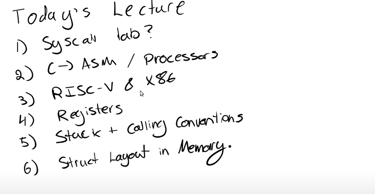

# Lecture05 介绍

[toc]

## 随堂记录

今天的课程，我们会稍微讲一些C语言转化成汇编语言的过程，以及处理器相关的内容。今天的课程更多是一门实用课程，至少我们的目标是这样的。这堂课的主要目的是让大家熟悉RISC-V处理器，汇编语言，以及RISC-V的calling convention。这是非常重要的，对pagetable来说不是很重要，但是对这周要做的traps lab实验很重要。这堂课对于debugging和implementing是必不可少的，因为你将直接使用trap frame还有堆栈之类的东西。

上图是今天课程的目标，我的第一个目标是复习一下6.004课程。或者其他你以前上过的关于计算机架构的课程。我想让大家回忆一下，C语言是如何变成汇编语言的。

通常来说，在C语言中有一个main函数，main函数执行一些东西，打印一些东西，然后exit退出。

.png)

这一切看起来很不错，但是学过6004课程的你们都知道，处理器实际上不理解C语言。处理器可以理解的是汇编语言，或者更准确的说，处理器能够理解的是汇编语言的二进制编码。就是我们看到的目标文件即.o文件。

在下面这张图中，我从一个SiFive（注，一家基于RISC-V处理器的厂商）主板上圈出了一个实际的RISC-V处理器。

.png)

当我们说到一个RISC-V处理器时，意味着这个处理器能够理解RISC-V的指令集。所以，任何一个处理器都有一个关联的ISA（instruction set architecture），ISA就是处理器能够理解的指令集合。每一条指令都有一个对应的二进制编码或者一个opcode。当处理器在运行时，如果看见了这些编码，那么处理器就知道该做什么样的操作。上图中的处理器正好理解RISC-V汇编语言。

所以通常来说，要让C语言能够运行在你的处理器上。我们首先写出C程序，之后这个C程序需要被编译成汇编语言。这个过程中有一些链接和其他步骤，但是因为这门课不是一个编译器的课程，所以我们忽略这些步骤，之后汇编语言会被翻译成二进制文件也就是.obj文件或者.o文件。

如果你关注过你的实验目录的代码，你会发现当你运行完make qemu命令，你会得到一大堆.o文件。这些都是处理器能够理解的目标文件。虽然你还没有写任何汇编程序，你们也可以在目录中看到一些.asm文件，这是由C语言编译生成的。如果你们学过了6.004，那么你们必然已经看过一些汇编语言。

汇编语言相比于C语言，结构性更差一些。汇编语言中都是一行接一行的指令，比如add，mult等等。汇编语言也没有很好的控制流（control flow），没有循环结构。汇编语言有函数（注，但是有基于lable的跳转），但是不是你在C语言中看到的那种函数。汇编语言中的函数是以label的形式存在，而不是C语言中的函数定义（function definition）。

汇编语言是一种非常底层的语言，还有很多其他语言也可以编译成汇编语言。比如说，C++也是同样的过程。运行任何编译型语言之前都需要先生成汇编语言。

上述流程基本就是让处理器理解我们所写的C语言代码的基本流程了。

## 模糊点

