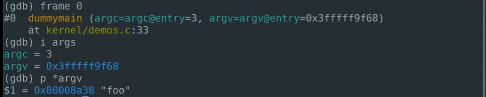
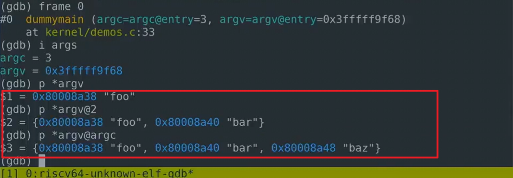

# stack

[toc]

接下来我们来讨论一下stack，stack之所以重要是因为它使得函数有组织，并能够正常返回。

下面是一个非常简单的stack的结构图。其中每个区域（box）都指的是一个stack frame。每执行一次函数调用都会产生一个stack frame。

.png)

每次调用一个函数，这个函数自己就会创建一个stack frame。函数是通过stack pointer来完成stack frame的内存空间分配的。

上图中sp表示stack pointer，这个非常重要请记住，对于stack来说是从高地址向低地址使用。所以栈总是向下增长。想要创建一个新的stack frame时，需要对stack pointer做减法来完成。当我们要在汇编中创建一个新的stack frame，stack就会向下扩展。函数的stack frame包含寄存器，局部变量，正如我之前说的，如果参数寄存器用完了，额外的参数就会出现在stack上，所以stack frame大小并不总是一样，即使在这个图里面看起来是一样大的。不同的函数有不同数量的局部变量，不同的寄存器，所以stack frame的大小是不一样的。但是关于stack frame有两件事是确定的：

* return Address总是胡出现在stack frame的第一位。
* previous stack frame，指向前一个stack frame的指针也会出现在栈中固定位置。

stack frame有两个重要的寄存器，一个是SP即stack pointer它指向stack的底部，代表了当前stack frame的位置。第二个是FP即frame pointer，它指向当前stack frame的顶部。因为return Address和指向前一个stack frame的指针即previous stack frame都是在当前stack frame的固定位置，所以可以通过当前的fp寄存器寻址到这两个数据。

我们存储previous frame pointer的原因是为了可以向后跳转，所以当前函数返回时，我们可以将previous frame pointer的值再存储到fp寄存器中，fp就开始指向返回后函数的stack frame。所以我们使用frame pointer来操纵我们的stack frame并确保我们总是指向正确的函数。

stack frame这部分需要使用汇编代码创建，所以是编译器生成了汇编代码，进而创建了Stack Frame。通常在函数的开头，你会看到function prologue，之后是function body，在之后是epilogue。这就是一个汇编函数通常看起来的样子。

.png)

我们从汇编代码中来看一下这里的操作：

.png)

在我们之前的sum_to函数中，只有函数体，没有stack frame的prologue与epilogue内容，它能很好的运行是因为它足够简单，它只需对a0操作就完成了所有的计算，并且它还是个leaf函数，leaf函数指的是不调用别的函数的函数，这种函数特别之处在于它不用保存它自己的return Address或者其他的caller saved registers。因为它不会调用其他函数。

sum_then_double就不是一个leaf函数，这里你可以看到，它调用了sum_to函数，所以这个函数中需要包含prologue，如下图：

.png)

这里我们对stack pointer减16，所以我们为新的stack frame创建了一个16字节的空间，之后我们将sum_then_double函数的return Address（即ra寄存器中的值）保存在stack pointer（即新sp的位置，新sp的位置对应的应该是sum_to函数的stack frame，假设sum_to的stack_frame上文说了，缺少prologue与epilogue）的位置，然后我们调用sum_to，接着sum_then_double函数对sum_to函数返回的result乘以2。

然后就是epilogue部分：

.png)

我们将return Address加载回ra寄存器（ld ra, 0(sp)），删除stack frame（addi sp, sp, 16），最后从sum_then_double函数中返回退出（ret）。

接下来我会演示demo2代码，demo2调用sum_then_double，sum_then_double会调用sum_to并将其返回值result乘以2再返回。

>TA问：这里我问大家个问题，如果我删除了sum_then_double的prologue与epilogue，只剩下函数体会发生什么？
>
>学生答：sum_then_double函数不知道它的return Address了，当sum_then_double调用了sum_to函数之后，ra寄存器被复写了，所以最终在sum_then_double运行完了之后，sum_then_double不知道如何返回到它的调用者那里。

是的，这完全正确，我们可以看一下具体会发生什么？我们用删除了prologue与epilogue之后的sum_then_double函数重新编译一下，我们看看会具体发生什么？

窗口1输入make qemu-gdb启动gdb server

窗口2输入riscv64-unknown-elf-gdb启动gdb client，然后在sum_then_double函数上打断点，然后tui enable启动tui，然后输入c（continue）。

此时会命中sum_then_double的断点；因为这个是个纯汇报函数，所以输入layout asm跟layout reg查看，这种情况下寄存器中的信息更重要。

我们可以看到当前的ra寄存器值为0x80006392，这个地址（demo2+18）指向demo2函数，demo2调用sum_then_double的函数。如下图：

.png)

接着我们一步一步调试，看看会发生什么。我们调用了sum_to函数，同时ra寄存器被复写了，ra现在的值为0x800065f4(sum_then_double+4)，这也合理，符合我们的预期。我们在函数sum_then_double中调用了sum_to，那么sum_to就应该要返回到sum_then_double。如下图：

.png)

之后我们执行完sum_to函数之后返回到sum_then_double函数了（sum_then_double+4）的位置，接着一步一步执行到sum_then_double的ret处（sum_then_double+10）。因为sum_then_double函数没有恢复自己的return address地址到ra寄存器，此时的ra寄存器的值（sum_then_double+4）依旧是sum_to函数的。所以我们会进入一个死循环，在sum_then_double+4，sum_then_double+6，sum_then_double+10这三条指令上无限重复不停止。

>学生问：为啥要对sp寄存器减16
>
>TA：为了创建我们的stack frame，对sp寄存器的值减16并更新，相当于将sp下移了这样对于我们自己的stack frame就有了空间，我们可以在那个空间里存数据。
>
>学生问：为什么不减4？
>
>TA：我猜也不用减16，减8就够了，但是减4有点太少了，因为接下来我们需要存储ra寄存器的值（64bit=8byte）与previous frame pointer的值（64bit=8byte），在我们手写的sum_then_double的汇编代码中没有这样做（指的是没有存储previous frame pointer的值）是因为没有很小心处理这里的汇编代码（就是忘了写了）。

接下来我们看下demo4函数，他基本是算main函数的模拟，有args参数（一个字符串数字），有dummymain函数，如下图：

.png)

在dummymain函数那里打个断点，然后跳过去看看，我们现在hit了dummymain函数如下图：

.png)

有几件重要的事要记住：

你可以使用gdb来查看stack frame，info frame就能看到当前stack frame很多有用的信息。

.png)

* stack level 0：表明这是调用栈的最底层，frame的地址是0x3fffff9f60
* pc：程序计数器
* saved pc：保存的程序计数器0x800064b6，去kernel.asm文件中查找这个地址，我们在demo4中找到了这个地址。表明当前的函数要返回的位置，return address。
* called by frame at 0x3fffff9f90 source language c；当前stack由0x3fffff9f90 这个地址的stack调用的，这是C代码。
* Arglist at 0x3fffff9f60：参数列表也是从0x3fffff9f60地址开始的。当前的参数都在寄存器中，可以看到argc=3，argv是这个地址0x3fffff9f68

使用命令info args会告诉我们关于函数参数的信息，如果输入backtrace（简写bt）可以看到从当前调用栈开始的所有stack frame如下图：

.png)

当我们调用一个系统调用时，我们将使用usertrap函数，然后是syscall函数，然后是sys_demo函数，然后是demo4函数，最后是dummymain函数。

如果你想探查其中一个stack frame，使用frame num进入该stack frame，下面使用info frame探查syscall函数的stack frame。

.png)

我们得到了很多很多信息，显示了一堆saved registers，显示了一堆局部变量，这个syscall没有任何参数，saved pc表示程序计数器应该跳到哪里。

上面这些信息对调试代码超级超级重要，接下来的实验之一，就是实现你自己版本的bracktrace helper函数。这在调试内核时候是很有用的，如果我们输入frame 0我们就会返回刚才的stack frame。

使用info args命令时，你会发现argv是一个字符串数组，我们得到的是一个地址，它实际存储的地址。如果想看它的实际值应该使用print *argv命令，我们得到了该字符串数组的第一个元素，就跟C语言一样，print会一直打印直到遇到null字符：

如果我们输入@然后加一个number数字，会打印直到number的索引才停止。然后我们可以看到两个字符串，gdb十分聪明，你甚至可以使用print  *argv@argc来打印整个字符串数组。

>学生问：为什么有时候编译器会优化掉argc与argv?
>
>TA：这意味着编译器发现了一条更有效的方法，不使用这些变量，而是通过寄存器来完成所有的操作。它可能只用a0就完成了所有的运算，编译器一定会做某种程度的优化的，
>
>学生问：$1与“foo”之间的地址是什么？就是0x80008a38
>
>TA：看demo4的C代码，传入dummymain函数的args其实是个指针数组，指针数组的元素分别是`0x80008a38, 0x80008a40, 0x80008a48`，每个元素都指向自己的字符串。
>
>学生问：0x80008a38, 0x80008a40, 0x80008a48这三个地址的间隔为什么都是8个字节呢？foo,bar,baz这些3个字节就够了呀？
>
>TA：我不能百分之百确定，我猜是因为数据对齐。

gdb不仅可以设立断点，还能设立观察点（watch），设立有条件的断点（b sum_to if i == 5）。这些课后自己查吧。